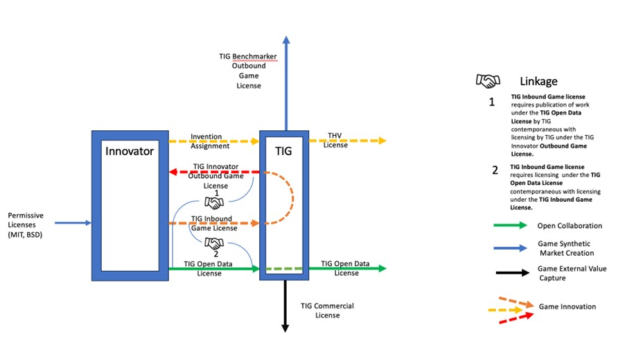

# Anatomy of TIG Licensing

**Capturing value from The Innovation Game IP**

## Introduction

The TIG Licensing programme seeks to:

- Reward (in the form of TIG tokens) **Innovators** by returning value to them for their innovation;

- Reward (in the form of TIG tokens) **Benchmarkers** for their participation in the _primary_ market for TIG innovation (the market that determines demand for and supply of improved algorithms within The Innovation Game and allocating TIG tokens accordingly) and for their contribution to securing the The Innovation Game protocol;

- Maintain the availability of submitted algorithm and code innovation for open collaborative development and further downstream innovation; and

- Capture value for TIG innovation in the _secondary_ market for TIG innovation (the market that determines the demand for improved algorithms and code for use under the TIG Commercial License) from commercial licensees.

Facilitation and regulation of innovators and benchmarkers participation in The Innovation Game is enabled by three TIG “game” licenses; **_The TIG Innovator Outbound Game License; The TIG Benchmarker Outbound Game License; and the TIG Inbound Game License_**.

The Innovation Game must achieve two objectives simultaneously; **(i)** the provision of a platform for open innovation so that the primary source of relevant innovators (research academics) can fulfil all their existing objectives without compromise; and **(ii)** the capture of value from the commercial use of the innovation submitted to The Innovation Game by innovators so that it can be returned to those innovators to incentivise their continuing innovation. The **_TIG Open Data License_** addresses the first objective and the **_TIG Commercial License_** addresses the second objective. These licenses represent the TIG “innovation distribution” licenses.

## Game Licenses

1. **_The TIG Innovator Outbound Game Licence:_** A licence which will gateway access to implementations previously submitted to The Innovation Game for use by innovators who wish to use those implementations to participate in The Innovation Game.

2. **_The TIG Benchmarker Outbound Game Licence:_** A licence which will gateway access to implementations previously submitted to The Innovation Game for use by bench-markers who wish to use those implementations to participate in The Innovation Game.

3. **_The TIG Inbound Game Licence:_** A licence which will gateway submissions of new implementations to The Innovation Game and which, in conjunction with the TIG Game Rules, will enable the TIG Foundation to secure Intellectual Property rights in the innovation resulting from participation in The Innovation Game.

## Innovation Distribution Licenses

1. **_The TIG Open Data Licence:_** A licence which will aspire to meet objective standards of openness for code and data, and which will include a **share alike obligation**.

    The _TIG Open Data License_ will require that if data (including implementations thereof) (“**Output Data**”) generated by execution of the subject algorithm implementation on certain input data is made available to third parties as data or in the form of a product derived from the data, then the input data processed by execution of the implementation to generate the Output Data together with any additional information to generate a product derived therefrom must also be made **generally available** to the extent necessary to allow a reproduction of the Output Data or product as the case may be (such input data hereinafter referred to as “**Relevant Data**”).

    The share alike obligation will require that; **(i)** where the subject algorithm implementation alone is distributed, the source code for the implementation must be made available under the _TIG Open Data License_ **to the recipient** of the algorithm implementation; and **(ii)** where Output Data is distributed, the source code for the implementation and the Relevant Data must be made **generally available** for distribution under the _TIG Open Data License_.

1. **_The TIG Commercial Licence:_** A licence which will allow closed use of the implementation and Relevant Data in return for the payment of a fee (non-discriminatory, means tested and rate card based) which will be used to underpin value in The Innovation Game incentives. In contrast with the _TIG Open Data License_, _The TIG Commercial License_ will provide greater freedom with respect to downstream licensing and will not impose an obligation to make Relevant Data available.

# GAME LICENSES (Outbound)

## TIG Innovator Outbound Game License

**Objective**

- To provide rights solely to use TIG Foundation algorithm implementations in The Innovation Game as the starting point for further innovation for submission to the TIG Foundation under the TIG Inbound Game License.

## TIG Benchmarker Outbound Game License

**Objective**

- To provide rights to use TIG Foundation algorithm implementations in The Innovation Game only for the purpose of benchmarking in The Innovation Game.

# GAME LICENSES (Inbound)

## TIG Inbound Game License

**Objectives**

- To secure contractual acceptance of The Innovation Game Rules by licensees.

- To ensure that code submitted to TIG is under a license that is compatible with the TIG licenses.

- In conjunction with the TIG Game Rules, to secure, where possible, assignment to The TIG Foundation of inventions related to the algorithm implementations submitted to The TIG Foundation.

- To provide reassurance that the submitted implementations will always be made available under the TIG Innovator Outbound License, TIG Benchmarker Outbound Game License, (i.e. assurance that any submissions will be made available for participants in The Innovation Game) TIG Open Data License (i.e. assurance to innovators that submissions to The Innovation Game will be made available for continuing open collaboration) and TIG Commercial License (i.e. assurance that any submissions to the game will be made available to enhance the value of TIG tokens over time).

- To incentivise innovation resulting from use of algorithms under the TIG Open Data License to also be made available by the innovator under the TIG Inbound Game License by ensuring that an innovator has the possibility of earning tokens by participating in The Innovation Game whilst still having the assurance that their innovation will be made available under the TIG Open Data License.

## TIG Compatible Licenses

**Objectives**

- **Preference for Contributor Original Works:** As stated below, the TIG Foundation will accept pre-existing algorithm implementations submitted under license terms which are different from the TIG Inbound Game License but which are nevertheless compatible with the TIG licenses (typically these will be permissive style open source licenses such as MIT or BSD) but has a **preference\*** for each algorithm and implementation of the algorithm submitted to be an original work of the entity making the submission which will allow; **(i)** the copyright to be licensed under the terms of the TIG Inbound Game License; and **(ii)** for underlying inventions to be assigned to The TIG Foundation so that any resulting patent rights can be leveraged by the TIG Foundation to prevent freeriding.

- **Compatibility with outbound TIG Licenses:** To facilitate outbound licensing which accords with the TIG IP Policy by limiting submissions to The Innovation Game to source implementations that are under licenses which are compatible with the TIG Inbound Game License, TIG Innovator Outbound Game License, TIG Benchmarker Outbound Game License, TIG Open Data License and TIG Commercial License. Licenses which are not compatible would include any non-permissive Open Source licences.

    \* _The effectiveness of sui generis Database rights, where they exist, are considered weak when applied to achieving copyleft effects and the copyright in the typically short code sequences used to express algorithms may be easily evaded by clean room reimplementation. For these reasons we wish to secure patent rights related to certain contributed algorithm implementations and accordingly TIG prefers assignment or, at least, licenses which give us the latitude to secure such rights._

# INNOVATION DISTRIBUTION LICENSES

## TIG Open Data Licence

**Objectives**

- To enable and perpetuate open and collaborative development of algorithms and their implementations.
- To enable and perpetuate open availability of relevant data to enable reproducibility.

**_Increasingly, code developed through open collaboration generates enormous value for certain users who contribute little back, in return. Even for code under a copyleft license, a user may modify the code (tailoring it to their particular use case) use the code internally (e.g. to process various data) then distribute the output, without any obligation to share either the modified code or the data._**

**_Examples of this type of activity range from large corporations who distribute the output as a product, to academic researchers who use open source programs to process experimental data, publish their results, but do not make the original data set available (making it far more difficult for anyone wishing to reproduce the researchers’ results)._**

**_To address these challenges and more, we have introduced the TIG Open Data License (TODL). The TODL is a license designed to increase freedom in both software and data processed using the software, areas which are becoming ever more intertwined as machine learning models become increasingly relevant and impactful._**

**_The TODL aims to address the above issues by requiring both code and input data to be made available when the output is shared._**

**_Main Challenges: The strategy embodied in the TODL is somewhat analogous to the copyleft technique insomuch as an input (source) is required to be made available when an output (target code) is distributed. However, our task is complicated by the general nature of the object to be made available: The input could be any sort of data, including source code, lists of (perhaps confidential) facts, copyrightable material or otherwise. Accordingly, unlike the principle of copyleft, we cannot rely on leveraging property rights such as copyright on the input, or even assume that the input can be made available whilst also meeting privacy requirements._**

**_Our strategy: Challenges arising from the inability to reliably secure property rights on input data are addressed by leveraging property rights on the program code used to process the data. With respect to privacy, we propose to permit synthetic versions of data sets to be made available when the original data cannot be released for privacy reasons. Synthetic data retains much of the utility of the original data set for many purposes (including the training of machine learning models) while mitigating the risk to privacy._**

## TIG Commercial Licence

**Objectives**

- To allow algorithm implementations and optimisations created by the licensee to be kept closed and proprietary if the licensee wishes.

- To allow algorithm implementations and optimisations created by the licensee to be used to process licensee data whilst allowing input data to be kept closed.

- To allow distribution in binary code form with licensee product (a product made by or for the licensee which incorporates a processing unit on which the algorithm implementation is executed).

- To allow distribution of the source code under the TIG Inbound Game License and TIG Open Data License.

- To allow distribution of the source code to any third party with a subsisting TIG Commercial License.

- To allow algorithm implementations to be used by licensee for processing third party data provided to it by any third party with a subsisting TIG Commercial License interacting with licensee remotely through a computer network.

- To secure consideration (non-discriminatory, means tested and rate card based) for the exploitation of the algorithm implementations to underpin incentive rewards in The Innovation Game.

- To ensure that the licensee does not assert patents against the algorithm implementation where it is licensed under the TIG Open Data License.

# FAQ TIG Licensing

## General

### Why have you adopted a hybrid licensing model; doesn’t it provide a route for open collaboration to be forked and taken closed again by commercial enterprises willing to pay ?

The aim of The Innovation Game is to return value derived by commercial enterprise, from foundational innovation, back to the innovators that created it, without compromising the open collaboration typically desired by such innovators. To do this it was essential to devise a way of capturing compensation for that value from those commercial enterprises whilst at the same time maintaining a route for open collaboration. The TIG Open Data License provides the path for open collaboration, but it is expected that for certain commercial enterprises the data disclosure requirements in that license will provide an incentive (i.e. avoidance of the data disclosure requirements) for them to alternatively take a commercial license for a fee which will then be reallocated to the original innovators.

It is possible, under the terms of the TIG Commercial License, that the development of the code distributed by TIG could be forked by a commercial licensee, and whilst this is an accepted trade off that is acknowledged, we believe that it is more than compensated by; (a) enabling an uncompromised channel for open collaboration under the TIG Open Data License; (b) The return of value from any creator of a fork (through the license fee paid under the TIG Commercial License) to innovators.

The hybrid licensing model is particularly well adapted to achieving The Innovation Game’s objectives because of its intrinsic design; The open collaboration objective can be uncompromised because the TIG Open Data License is not trying to balance openness and adoption. The Innovation Game envisions that open innovation can be served by two licensing streams acting in different ways; the TIG Open Data License is written so that its terms do not compromise open innovation (indeed the terms require making both code and data available to support reproducibility) whilst providing an alternative way to access the same technology under the terms of The TIG Commercial License in return for a fee which in turn enhances the value of innovator rewards to encourage more innovation which will ultimately be licensed under the TIG Open Data License.

Essentially The Innovation Game ecosystem provides a guaranteed channel for open collaboration whilst capturing value from those that wish to operate outside that channel which in turn will enhance the value of the incentives for those that participate in the channel for open collaboration.

### Why do you seek to file patents on certain submissions made to The Innovation Game ?

Published algorithm implementations may be protected by two types of intellectual property right: Patents and copyright. Copyright only protects the _expression_ of ideas (the, so called, idea, expression dichotomy) whilst patents can protect the ideas themselves.

Because copyright protection is limited to the expression of ideas only, it is possible to re-express the ideas expressed in one algorithm implementation in another implementation of the algorithm provided the reimplementation does not copy the original implementation expression. This makes the ideas in algorithm implementations vulnerable to being copied in a reimplementation unless those ideas are protected by patents.

Algorithms are essentially mathematical methods and as such are generally not considered patentable subject matter. However, if an algorithm is used in a specific and novel way that results in a technical effect it might be patentable. Software, implementing algorithms has been successfully patented where it can be demonstrated that the underlying invention provides a concrete and tangible result i.e. that the algorithm contributes to the solution of a technical problem.

The algorithm innovations submitted to The Innovation Game will comprise two different types; new and improved algorithms (i.e. mathematical methods) themselves and optimisations to the software code which implements the algorithm. It is patents that will be used to protect the former type and copyright to protect the latter type.

We believe that there will be significant value in the copyright in the optimised code expression because a reimplementation must not copy the code optimisations in the original implementation.

Notwithstanding that the copyright will afford significant value in the optimised software code implementations we do still need patents related to the algorithms themselves to prevent free riding of the value (which could be significant) associated with the improved underlying algorithms.

### How does The Innovation Game secure intellectual property rights in respect of submitted algorithms ?

To help nurture and sustain open collaboration it is important that there is a disincentive to escape the “copyleft effect” sought by the TIG Open Data Licence with respect to the innovation incentivised and captured by The Innovation Game. Therefore, in addition to any copyright assigned to TIG in code submitted to The Innovation Game (which may be evaded by re-implementation), TIG wishes to seek patents on the technical effects of certain algorithmic advances embodied in submitted code.

TIG will provide enhanced rewards for code submissions which embody an algorithmic advance. To be considered for such enhanced rewards the Innovator must**: (i)** submit a claim which meets certain minimum disclosure criteria; and **(ii)** provide a fixed deposit. Whether the submitted code meets the standard to be classified as an algorithmic advance will be determined by a vote which will be open to all TIG token holders.

TIG will file a provisional patent application (taking advantage of the twelve month grace period for disclosure available in the US) in relation to algorithmic advances prior to publication of such advances in The Innovation Game.

Based on the market signal of adoption of the algorithm in The Innovation Game, TIG may subsequently file respective full patent applications.

### How are the license fees determined ?

_Rate Card Policy.\[TBD\]_

The license fees will be adjustable to respond to demand and the growth of value of the innovation and intellectual property in The Innovation Game over time. The fees will be determined by vote of token holders who will naturally balance the impact of price increases on the volume of licensing to maximise absolute return. Token holders will want to maximise token value not just because it will impact the immediate value of their holdings but because the token provides the incentive for future innovation which will increase the value of the token over time.

### What assurance does a licensee have that the licensed algorithm implementations do not infringe third party intellectual property rights ?**

The TIG Inbound Game License secures license rights for TIG with scope that is sufficient to support onward licensing of a contributors IP under any of the downstream TIG licenses. With respect to code that is not the original work of a contributor the level of exposure to third party IP infringement is the same as it would be under the license under which it was contributed (e.g. MIT, BSD, Apache). For IP that is assigned to TIG in return for enhanced rewards any patent granted related to that IP will only be granted by an examiner if it is novel which would be a firm indication that it is an original invention.

## TIG Open Data License

### Is the Open Data License compliant with the Open Source Definition ?

The Open Source Initiative have proposed a ten factor test for assessing whether or not a license is compliant with the Open Source Definition. TIG does not claim that the TIG Open Data License is compliant with the Open Source Definition. However, The TIG Open Data License seeks to provide both sufficient access and sufficient rights to foster open collaboration in science.

The Open Source Definition reveals the elements required to support open collaboration for software development and thus was obviously a very useful source and guide when drafting the TIG Open Data License.

If the licensee is only distributing the software and not data then the TIG Open Data License operates like a copyleft open source license but because The TIG Open Data License links the openness of data and the openness of software it may be the case that we do not satisfy factor 6 of the definition (_No discrimination against fields of endeavour_) because certain businesses (where the input data has significant value to them) may consider their freedom to use the software is compromised by the obligation to make input data available where output data is distributed.

### Why do I have to distribute code to TIG under the TIG Open Data License at the same time that I submit code to TIG under the TIG Inbound Game License ?

One of the key priorities of TIG is to ensure that all submissions made to The Innovation Game remain available for open collaboration. To provide assurance to innovators that this will happen, TIG requires that any submission to TIG under the TIG Inbound Game License is contemporaneously licensed under the TIG Open Data License.

### Can code licensed under the TIG Open Data License be submitted to The Innovation Game under the TIG Inbound Game License ?

No. The TIG Open Data License has a **share alike** provision in it which means that it is not compatible with the other TIG licenses. However, we do hope that the incentives provided by The Innovation Game will be sufficient to encourage an author that makes a modification to code obtained under the TIG Open Data License to submit that modification to The Innovation Game under the TIG Inbound Game License (effectively dual licensing the code that they have authored and in which they own the copyright) and therefore prevent a forking of development outside of The Innovation Game. Indeed, the optimal strategy for an innovator (if they wish to earn TIG tokens for their innovation and benefit from the patent non-assert in the TIG Commercial License)) would be to license an algorithm under the TIG Innovator Outbound Game License then submit the improved algorithm to TIG under the TIG Inbound Game License (which guarantees onward licensing under the TIG Open data License). Essentially, if TIG is successful, the TIG Open Data License will become a license under which code is _used_ rather than a license under which code is _developed_ (although importantly it does not preclude development) and instead development will be done under the TIG Outbound License thus capturing the value of the innovation within The Innovation Game.

### Is the requirement to make all “Product Information” available under the TIG Open Data License necessary ?

It is the intention of TIG to make the TIG Open Data License acceptable to the academic research community whilst permitting a commercial entity who may find the terms of the TIG Open Data License unappealing to pay for a commercial license if they wish to make use of TIG innovation. We believe that Product Information is equivalent to the data necessary to allow reproducibility of results. Whilst a requirement to disclose such information may be acceptable to academic researchers it will likely be sufficiently broad in its scope to capture data which a commercial entity would prefer to keep proprietary.

### Do you believe that meta algorithms such as training algorithms for machine learning models can be licensed successfully under the TIG Open Data License ?

Yes. If a challenge is supported in the game that results in algorithms that are relevant to meta algorithms, then it is our belief that open collaboration under the TIG Open Data License will be acceptable to the academic research community, where disclosure of data necessary to enable the reproducibility of results is already accepted and encouraged. Commercial entities that are reluctant to disclose data as required by the TIG Open Data License will be incentivised to avoid licensing under the TIG Open Data License and therefore to subscribe to a commercial license if they wish to use the TIG algorithms.

### How does the TIG Open Data License deal with data privacy in respect of its data disclosure obligations ?

The TIG Open Data License only requires disclosure pf data that does not retain any personally identifiable information.

## TIG Assignment Agreement

### Am I obliged to assign the IP in my algorithm improvement to TIG ?

No. The assignment of intellectual property related to algorithmic breakthroughs will be an important contributor to driving the value of the innovator incentives (TIG Tokens) over time but there is no obligation to assign ownership of any intellectual property to TIG. It is the intention of TIG to introduce enhanced rewards for algorithmic breakthroughs that are submitted to the game should the innovator wish to claim them. Assignment of ownership of inventions will only be necessary if an innovator wishes to claim enhanced rewards.

## TIG Benchmarker Game License

### Can I distribute code received under the TIG Benchmarker Outbound Game license to third parties ?

No. Code received under the TIG Benchmarker Outbound Game License can only be used for benchmarking in The Innovation Game and onward distribution of the code is not permitted.

## TIG Inbound Game License

### Can I submit code to The Innovation Game under the BSD licenses ?

Yes. The BSD licenses are all permissive forms of license which permit relicensing under different license terms.

### Can I submit code to The Innovation Game under the MIT licenses ?

Yes. The MIT licenses are all permissive forms of license which permit relicensing under different license terms.

### Can I submit code to The Innovation Game under the Apache licenses ?

Yes. The Apache Licenses do have share alike provisions which means that code licensed under the Apache Licenses must remain licensed under the Apache Licenses, but the Apache License terms are compatible with the terms of the licenses under which submissions to The Innovation Game are licensed. Modifications to code licensed under the Apache license can be licensed under a license of the author’s choice and the TIG Inbound Game license requires that such modifications would be licensed under the TIG Open Data License and TIG Inbound Game License.

## TIG Commercial License

### What prevents source code licensed by TIG from escaping the open collaboration obligations in the TIG Open Data License when a licensee under the TIG Commercial License distributes source code ?

The TIG Commercial License only permits distribution of source code under The TIG Inbound Game License (resulting in the code released under it re-entering The Innovation Game and being redistributed under the TIG Open Data License) and the TIG Open Data License or to a third party that is a subsisting licensee under The TIG Commercial License and subject to the terms of the TIG Commercial License. These limited rights to distribution of source code prevent the source code from escaping under more permissive terms than the TIG Open Data License.

### How would the TIG Commercial License work with a distributor of algorithms like Mathworks ?

The terms of the TIG Commercial license anticipates the business model of an intermediary distributor of algorithms and allows distribution of the source code to any third party with a subsisting TIG Commercial License.