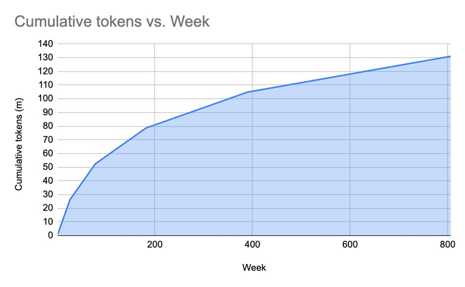

# 1. Basics

## 1.1. Overview

The Innovation Game (TIG) is the first and only protocol designed specifically to accelerate algorithmic innovation. At the core of TIG lies a novel variant of proof-of-work called optimisable proof-of-work (OPoW).

OPoW uniquely features multiple proof-of-works, “binding” them together in a manner that prevents centralisation due to optimisations of the proof-of-work algorithms (see Section 2.1 of the TIG white paper for details). This resolves a longstanding issue that had hindered proof-of-work from being based on real-world computational scientific challenges.

TIG combines a crypto-economic framework with OPoW to:

1. Incentivise miners, referred to as Benchmarkers, to adopt the most efficient algorithms (for performing proof-of-work) that are contributed openly to TIG. This incentive is derived from sharing block rewards proportional to the number of solutions found.
2. Incentivise contributors, known as Innovators, to optimise existing proof-of-work algorithms and invent new ones. The incentive is provided by the prospect of earning a share of the block rewards based on adoption of their algorithms by Benchmarkers.

TIG will progressively phase in proof-of-works over time, directing innovative efforts towards the most significant challenges in science.

## 1.2. Blocks

In TIG, a block serves as the fundamental unit of time, roughly equivalent to 60 seconds. Blocks fulfil two primary functions:

1. Timestamp for when Benchmarkers start & submit their solutions
2. Execution of OPoW-related state transitions, determining Benchmarkers' influence and algorithm adoption, leading to the distribution of block rewards denominated in TIG tokens.

## 1.3. Rounds

A round spans 10,080 blocks, approximately equivalent to 604,800 seconds or 7 days. Rounds serve three primary purposes:

1. Execution of algorithm related state transitions.
2. Coordination of protocol and configuration updates, including the introduction of new challenges and voting procedures.
3. The token emission schedule is structured around rounds.

## 1.4. Token Emission Schedule

TIG’s token emission schedule comprises 5 tranches, each with the same total emission of 26,208,000 TIG, but successively doubling in duration (measured in rounds):

| **Tranche** | **#Rounds** | **Token emissions per block** | **Token emissions per round** | **Start Date** | **End Date** |
| --- | --- | --- | --- | --- | --- |
| 1   | 26  | 100 | 1,008,000 | 24 Nov 2023 | 1 June 2024 |
| 2   | 52  | 50  | 504,000 | 1 June 2024 | 31 May 2025\* |
| 3   | 104 | 25  | 252,000 | 31 May 2025\* | 29 May 2027\* |
| 4   | 208 | 12.5 | 126,000 | 30 May 2027\* | 24 May 2031\* |
| 5   | 416 | 6.25 | 63,000 | 25 May 2031\* | 14 May 2039\* |

\*Approximates

Post tranche 5, rewards are solely based on tokens generated from TIG Commercial license fees.

## 1.5. TIG Token

The TIG token adheres to the ERC20 standard and is deployed to Basechain at the following address: [0x0C03Ce270B4826Ec62e7DD007f0B716068639F7B](https://basescan.org/token/0x0C03Ce270B4826Ec62e7DD007f0B716068639F7B).

TIG tokens earned during a round are minted within 7 days following the conclusion of that round.
