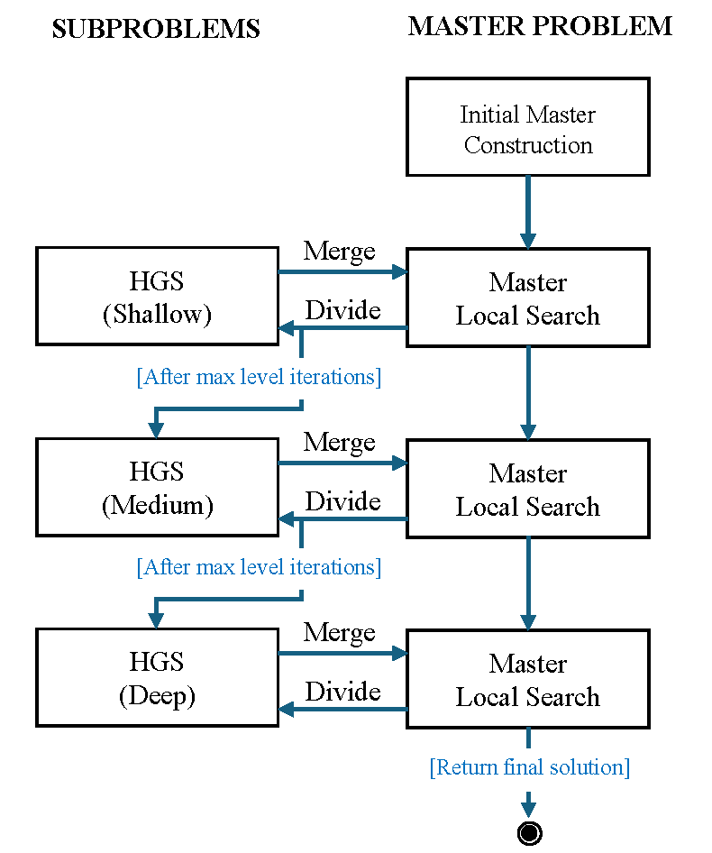
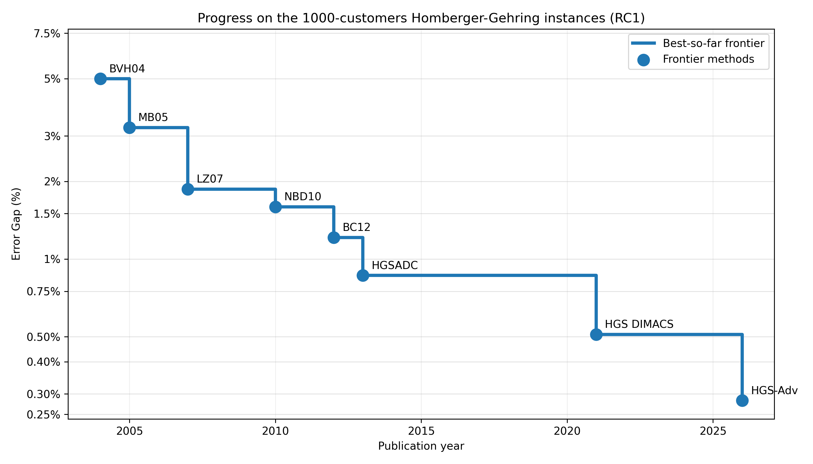
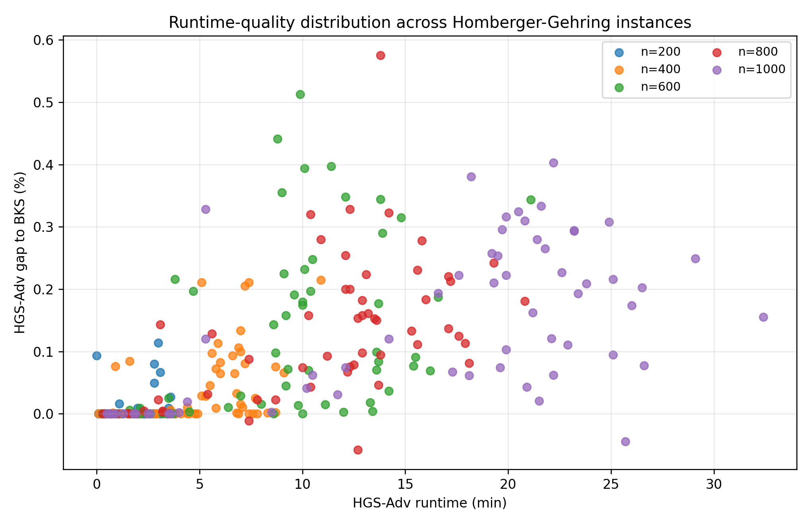

## UNIQUE ALGORITHM IDENTIFIER (UAI)

> c002_a110

# ADVANCE EVIDENCE TEMPLATE

**EVIDENCE IN SUPPORT OF A REQUEST FOR ELIGIBILITY FOR ADVANCE REWARDS**

## INTRODUCTION

This document presents the advance-evidence draft for **HGS_advance** in the TIG `vehicle_routing` challenge. The method addresses a central scalability limitation of Hybrid Genetic Search (HGS) for large vehicle routing instances, especially capacitated and time-windowed variants. HGS, as exemplified by the open-source [HGS-CVRP](https://github.com/vidalt/HGS-CVRP) implementation and the TIG baseline [HGS_v1](https://github.com/tig-foundation/tig-monorepo/tree/main/tig-algorithms/src/vehicle_routing/hgs_v1), is highly effective and performs a thorough exploration of the solution space because it combines population-based exploration with aggressive local search. However, this strength also becomes a bottleneck at large scale: offspring are repeatedly improved through expensive full-dimensional local searches, and population evolution may spend substantial effort refining regions of the search space where many route structures are already stable.

**HGS_advance** is a significant contribution to this scalability issue and is based on three complementary components. First, an **evolutionary consensus mechanism** detects predecessor-successor relations that remain stable across successive feasible individuals in the population. This multi-generation consensus compresses the problem while preserving instance semantics (i.e., a VRPTW instance with time windows and demands remains equivalent to the aggregated instance where those arcs are fixed). Second, a decomposition strategy called **reverse mode** aggressively improves a global incumbent by solving subproblems with population search at increasing exploration depth and reinjecting improvements at the master level. This strategy is intentionally simple but unexpectedly efficient, reaches high-quality solutions in few phases, and provides linear-time scaling capabilities for large instances. Third, a **high-performance local-search engine** makes both the full and reduced searches efficient through customer-level best-move selection, systematic lower-bound prefilters before more expensive sequence evaluations, and a bounded first-loop deterioration mechanism that provides limited diversification before returning to strict improvement.

Together, these components define a scalable HGS architecture in which consensus compression reduces the active problem size, reverse mode reduces the active search region, and the local-search engine reduces wasted move evaluations. These mechanisms are synergistic and interact throughout the run: the master solution induces high-quality seed solutions for the route-cluster subproblems; these seeds are deliberately inserted later to preserve early subproblem diversity; and, even before insertion, they participate in the consensus process to ensure that compression decisions are consistent with the inherited master structure. The implementation preserves the core strengths of HGS while making the method better suited to large-scale CVRP/VRPTW instances under limited computational budgets.

## SECTION 1: DESCRIPTION OF YOUR ALGORITHMIC METHOD

PLEASE IDENTIFY WHICH TIG CHALLENGE THE METHOD ADDRESSES.

> vehicle_routing

PLEASE DESCRIBE THE METHOD THAT YOU HAVE SELECTED FOR ASSESSMENT.

> **A scalable Hybrid Genetic Search (HGS) framework for large-scale vehicle routing problems.**  
> 
> The selected method extends the standard HGS paradigm by reducing the effective search effort and improving solution quality on large-scale instances. It does so through three coordinated mechanisms:
>
> 1. **Evolutionary consensus compression**, which detects stable predecessor-successor relations across the evolving population and accordingly reduces problem size while preserving vehicle routing (CVRP or VRPTW) semantics.
> 2. **Reverse-mode decomposition**, which improves a global incumbent through a phased sequence of subproblems solved by HGS with progressive exploration depths and reintegrated at the master level.
> 3. **A high-performance local-search engine**, tailored to large-scale CVRP/VRPTW instances, which combines customer-level best-improvement, systematic move prefilters, and a move acceptance policy allowing bounded early deterioration to provide controlled diversification.
>
> These components are symbiotic. The consensus mechanism reduces the problem size when the population reveals stable arc structures. Reverse mode reduces the active search region by applying HGS to spatially coherent route clusters. Finally, the local-search mechanism accelerates both the full and reduced searches by limiting expensive sequence-based evaluations to moves that pass cheaper lower-bound filters and provides additional diversification capabilities.
>
> **Detailed mechanism description**
>
> **A) Evolutionary consensus compression**
>
> The evolutionary consensus mechanism turns population convergence into a problem-size reduction signal. Instead of using the population only for parent selection and diversity management, the algorithm monitors the solution arcs that remain stable across feasible individuals over a consensus epoch (typically around a hundred new solution generations). At the end of each epoch, stable predecessor-successor relations are detected, the corresponding client chains are contracted into clients with equivalent properties regarding VRPTW cost and feasibility checks, and the HGS continues on the compressed problem.
>
> The mechanism proceeds as follows:
>
> 1. **Enable consensus tracking during GA evolution.**  
>    Consensus tracking is activated after the initial population has been generated, so that the mechanism is based on meaningful evolved solutions.
>
> 2. **Start a consensus epoch.**  
>    On the first feasible individual of the epoch:
>    - record the successor and predecessor of every client;
>    - mark every client successor and predecessor relation as provisionally stable.
>
> 3. **Update consensus across subsequent feasible individuals.**  
>    For each later feasible individual in the same epoch:
>    - compare every client successor and predecessor relation with the epoch reference;
>    - if a successor or predecessor differs from the reference, mark that relation as unstable;
>    - retain only relations that remain identical across all observed feasible individuals in the epoch.
>
> 4. **Build consensus chains at the compression trigger.**  
>    Every `nb_it_compression` iterations, the algorithm:
>    - extracts maximal chains from stable predecessor-successor relations;
>    - separates complete stable routes from partial stable chains;
>    - keeps complete stable routes as fixed routes when applicable, effectively eliminating these clients and reducing the number of vehicles;
>    - converts valid partial chains into single clients with equivalent properties;
>    - leaves unstable or invalid chains uncompressed.
>
> 5. **Preserve VRPTW semantics during compression.**  
>    Each macro-client stores the aggregate demand, internal travel time, service duration, and equivalent time-window information needed to evaluate the compressed instance consistently.
>
> 6. **Continue the GA on the compressed instance.**  
>    After compression:
>    - the current population is remapped to the compressed problem;
>    - fixed route distances are carried as a constant offset;
>    - the local search and crossover operators continue on the reduced representation;
>    - the consensus epoch is reset and monitoring restarts on the new active instance.
>
> This mechanism progressively removes route segments that the evolutionary process has already stabilized, allowing subsequent search effort to focus on unresolved parts of the instance rather than repeatedly reoptimizing consensual arcs.
>
> **B) Decomposition mechanism, i.e., "reverse mode"**
>
> The reverse-mode decomposition mechanism is designed for large instances where running the full HGS on the complete problem becomes inefficient. Instead of evolving a full-scale population throughout the run, the method builds a single feasible master solution and repeatedly decomposes it into spatially coherent route-cluster subproblems. Each subproblem is solved with HGS at a prescribed exploration level, and the resulting improvements are reintegrated into the master solution before a global local-search pass.
>
> The term **reverse mode** reflects this inverted search organization. Rather than maintaining a global population that generates full-scale offspring, the method maintains a single master trajectory and applies population-based search only inside smaller subproblems. This is related in spirit to large-neighborhood search, where part of a solution is iteratively destroyed and rebuilt, but differs in the scale of the changes and the strength of the reconstruction step: instead of relying on a constructive or local-search heuristic, reverse mode uses HGS capabilities to explore much larger and richer sub-neighborhoods.
> 
> The mechanism proceeds as follows:
>
> 1. **Build an initial feasible master incumbent.**  
>    The algorithm starts from several constructive solutions, improves them with local search, and applies repair when necessary. The best feasible result becomes the initial master incumbent.
>
> 2. **Define a phased exploration schedule.**  
>    The algorithm runs a sequence of decomposition phases. Each phase uses a prescribed HGS exploration level for the subproblems, typically progressing from shallow to deeper search. This allows the method to first capture easy improvements cheaply, then spend more computation on harder subproblem refinements only after the master solution has improved.
>
> 3. **Divide the current master solution into route-cluster subproblems.**  
>    At the beginning of each phase:
>    - the number of subproblems is set as `k = round(nb_nodes / decomp_target_size)`;
>    - each current master route is represented by its spatial barycenter;
>    - seed routes are selected to initialize the route clusters;
>    - the remaining routes are assigned iteratively by adding the closest unassigned route to the cluster with the fewest customers.
>
>    This produces subproblems that are spatially coherent and roughly balanced in size. The decomposition is performed at the route level, consistently with the current master solution, rather than at the isolated-customer level. As a result, the current master solution directly induces a feasible and meaningful seed solution for each subproblem.
>
> 4. **Solve each subproblem with HGS.**  
>    For each route-cluster subproblem:
>    - the clients belonging to the selected master routes are extracted;
>    - a local subproblem is built with the same demand, distance, and time-window semantics as the original instance;
>    - the current master routes restricted to that cluster are used as a seed solution;
>    - HGS is run on the subproblem (with decomposition disabled, preventing recursive decomposition);
>    - the seed solution is not inserted immediately. It is kept as a reserved individual and injected later (either when the subproblem incumbent reaches comparable quality, or around half of the iteration/no-improvement budget);
>    - this delayed insertion preserves early diversity while still allowing crossover and local search to combine the master-derived seed with newly discovered route structures;
>    - interaction effect with consensus: the reserved seed is still included in consensus checks before insertion, so compression decisions are anchored to a high-quality master-consistent route structure. In practice, this reduces the risk of over-committing to unstable arcs and helps prevent harmful consensus contractions.
>
>    The subproblem HGS therefore acts as an intensification mechanism around a restricted but meaningful portion of the master solution.
>
> 5. **Merge subproblem solutions into a master candidate.**  
>    After all subproblems have been solved, their resulting routes are merged back into a complete master candidate.
>
> 6. **Run global master local search and repair.**  
>    The merged solution is then improved by a global local-search pass on the full instance. If this pass produces an infeasible solution, repair is attempted. If repair fails, or if the repaired solution is worse than the pre-local-search merged solution, the algorithm rolls back to the master candidate.
>
> 7. **Return the best feasible master solution.**  
>    After all phases are completed, the algorithm returns the best feasible master solution found during the reverse-mode process. This general decomposition mechanism is summarized in the figure below.
> 
> 

>      
>    

>
>    
<em>Figure: Reverse-mode strategy</em>

>
> This decomposition strategy is the second core scalability component of the method, as it reduces the active search region by replacing one large full-dimensional HGS run with a controlled sequence of subproblem HGS runs at increasing search depths, each one followed by one master-level local-search pass. Interestingly, our experimental analyses demonstrate that maintaining a single search trajectory at the master level, that is, focusing all the subproblems on the improvement of a single solution, performs extremely well.
>
> **C) High-performance local-search mechanism for large-scale vehicle routing**
>
> The third component of the selected method is a high-performance local-search mechanism designed to make HGS more effective on very large CVRP/VRPTW instances. In standard HGS, especially on very large instances, local search is the dominant computational bottleneck: every generated offspring must be "educated," and each education phase may require testing a very large number of candidate moves. The proposed mechanism targets this bottleneck through several complementary ideas, notably customer-level best-move selection, systematic lower-bound prefilters before expensive evaluations, controlled first-loop deterioration for diversification, and efficient reuse of local-search information across inherited or unchanged route structures.
>
> The mechanism proceeds as follows:
>
> 1. **Use customer-level best-move selection rather than immediate first improvement.**  
>    The local-search loops remain organized around each customer `i`: for a given customer, the method evaluates the admissible moves involving that customer, selects the best one for `i`, applies it, and then continues. Inter-route exploration is restricted by a granularity parameter: for each customer `i`, the method considers at most `gamma` promising neighbors. More precisely, these neighbors are interpreted as promising predecessors for `i`, so the tested moves always introduce at least one attractive edge linking a predecessor to `i`. The depot-adjacent case is handled separately: insertions immediately after the depot are still examined when relevant, but without requiring a full scan of route starts. Intuitively, while the depot could act as a promising predecessor for any customer, the method recovers these cases through a complementary successor-based argument. This gives an aggressive search trajectory while keeping the evaluation very efficient.
>
> 2. **Apply systematic lower-bound prefilters before full sequence evaluation.**  
>    Full move evaluation in VRPTW requires sequence-based calculations, which are substantially more expensive than in the CVRP because they must calculate time information along route fragments and ultimately determine whether time-window violations arise. The local search first applies fast lower-bound filters that rely on distance and capacity information to discard moves that are already provably unpromising. A candidate move is evaluated completely, including the full sequence-based time-window computation, only if it survives these preliminary tests. This reduces the number of more consuming VRPTW evaluations and avoids spending effort on moves that can be rejected by simpler bounds.
>
> 3. **Allow bounded deterioration during the first local-search loop.**  
>    During the first loop of local search, the method uses a small deterioration budget controlled by a parameter called `max_credit_deterioration`. Improving moves generate credit equal to their improvement, up to this cap. Subsequent non-improving moves may be accepted only if their deterioration is no larger than the available credit. When such a deteriorating move is accepted, the credit is decreased accordingly.
>
>    This mechanism provides a controlled form of diversification. It allows the search to cross shallow local barriers after it has already accumulated enough improvement to compensate for the temporary deterioration. The deterioration is therefore not arbitrary: it is bounded, locally budgeted, and earned through previous improvements. It is also deterministic and easy to calibrate, unlike simulated annealing (SA) mechanisms whose performance can be highly sensitive to the temperature schedule. In practice, this significantly increases search capabilities without significantly impacting runtime.
>
> 4. **Return to strict improvement after the first loop.**  
>    From the second local-search loop onward, the deterioration budget is disabled and the search becomes a strict improvement procedure. This ensures that the final local-search outcome remains locally improved with respect to the accepted move set, while the first loop retains enough flexibility to avoid overly greedy early decisions.
>
> 5. **Avoid redundant move evaluations with route and customer timestamps.**  
>    The local search maintains modification timestamps for routes and testing timestamps for customers. If neither the route of customer `i` nor the relevant neighboring route has changed since the last evaluation, the corresponding move tests are skipped. This avoids repeated evaluations of route pairs for which all relevant moves have already been tested without success. This mechanism is especially useful after crossover. When an offspring inherits feasible routes unchanged from a majority parent, these routes are marked as already tested. They are not bypassed by the local search, but instead, the local search concentrates on modified routes and on interactions involving at least one route that has changed. This makes offspring education more scalable by avoiding unnecessary reevaluations of moves involving stable inherited route structures.
>
> In summary, this local-search component improves scalability by reducing unnecessary work at multiple levels: it keeps the search organized around one customer at a time, bounds the inter-route candidate set for that customer by the granularity parameter, filters out unpromising moves before complete evaluation, allows deterministic diversification on the first loop, and avoids reevaluating unchanged route structures. It remains compatible with the HGS philosophy of aggressive education, but makes this education substantially more efficient for large-scale instances.

## SECTION 2: IMPLEMENTATION EMBODYING YOUR METHOD

TO THE EXTENT THAT YOU HAVE IMPLEMENTED THE METHOD IN CODE YOU SHOULD IDENTIFY THE CODE AND SUBMIT IT TOGETHER WITH THIS DOCUMENT.

> The code attached to the advance submission includes all the described components, notably in the following files:
> - `solver.rs`: entry point and mode selection (reverse mode when `params.decomp_nb_phases > 0`, else standard HGS).
> - `genetic.rs`: main HGS loop, crossover/education flow, compression triggers and population remapping.
> - `population.rs`: feasible/infeasible subpopulations and consensus tracking (including consensus checks that incorporate the reserved delayed seed).
> - `compression.rs`: consensus-chain contraction into compact instances with preserved routing semantics.
> - `reverse_mode.rs`: decomposition workflow (subproblem build/map, phased subproblem solves, merge, master LS/repair).
> - `local_search.rs`: high-performance LS, acceptance policy, bounded loop-1 deterioration, and move prefilters.
> - `params.rs`: presets and method controls

## SECTION 3: TECHNICAL EFFECT

**YOUR NOMINATED TECHNICAL EFFECT FOR ESTABLISHING THE RELEVANT FIELD**: PLEASE IDENTIFY THE TECHNICAL EFFECT OF YOUR METHOD WHEN EXECUTED ON A COMPUTER WHICH YOU WISH TO BE USED TO HELP DETERMINE THE RELEVANT FIELD.

> The nominated technical effect is a scalability improvement for large-scale CVRP/VRPTW instances, obtained by reducing the effective search dimension of HGS and reallocating computation toward the parts of the solution that remain improvable, while preserving the feasibility and evaluation semantics of the original vehicle routing problem. When executed on a computer, the method changes the computational behavior of HGS in three coordinated ways:
>
> 1. **Evolutionary consensus compression** reduces the active instance size progressively throughout HGS's execution by contracting route segments that remain stable across the evolving population. This allows iterations on smaller compressed instances while retaining the demand, distance, service-time, and time-window information needed for valid VRPTW evaluation.
>
> 2. **Reverse-mode decomposition** reduces the active search region by replacing a single full-scale HGS search with a sequence of smaller route-cluster subproblem searches. These subproblems are seeded from the current master solution, solved at controlled exploration depth, and reintegrated into the master solution through a global local-search and repair step.
>
> 3. **The high-performance local-search mechanism** reduces the cost of the dominant HGS operation, namely offspring education, by applying customer-level best-move selection (i.e., hybrid policy between first and best improvement), lower-bound prefilters before full sequence evaluation, bounded early deterioration for diversification, and timestamp-based avoidance of wasteful move evaluations.
>
> The combined technical effect is therefore not only faster execution, but a different allocation of computational effort: the algorithm spends less time repeatedly reoptimizing stable or unpromising structures and more time exploring the search space. This leads to a stronger runtime-quality tradeoff on large-scale routing instances.

**ADDITIONAL TECHNICAL EFFECTS**: PLEASE IDENTIFY ANY TECHNICAL EFFECTS OF YOUR METHOD WHEN EXECUTED ON A COMPUTER IN ADDITION TO YOUR NOMINATED TECHNICAL EFFECT.

> - **Faster convergence to high-quality feasible solutions** on large instances, because fast improvements are captured through shallower subproblem phases before deeper exploration is attempted.
>
> - **Lower local-search overhead per offspring**, because many candidate moves are rejected using fast lower-bound tests before full VRPTW sequence-based evaluations are performed.
>
> - **Controlled local diversification without stochastic temperature tuning**, because the bounded first-loop deterioration mechanism allows limited non-improving moves only when paid for by prior improvements, then returns to strict improvement from the second loop onward.
>
> - **Preservation of feasibility semantics under compression and decomposition**, because the compressed subproblem instances retain the information needed to evaluate distance, load, service time, and time-window violations consistently with the original problem.

## SECTION 4: FIELD

**YOUR NOMINATED FIELD BASED ON YOUR NOMINATED TECHNICAL EFFECT:** PLEASE IDENTIFY THE FIELD THAT YOU BELIEVE MOST CLOSELY ALIGNS WITH YOUR NOMINATED TECHNICAL EFFECT OF YOUR METHOD.

> The nominated field is **metaheuristics for combinatorial optimization**, with a focus on vehicle routing problems, including capacitated and time-windowed variants.

**ADDITIONAL FIELDS**: PLEASE IDENTIFY ANY FIELDS, OTHER THAN YOUR NOMINATED FIELD, IN WHICH YOUR NOMINATED TECHNICAL EFFECT MIGHT BE RELEVANT.

> - **Evolutionary computation**, because the method uses population convergence and stable inherited structures as an active signal for search-space reduction.
>
> - **Graph contraction and coarsening for optimization**, because evolutionary consensus compression contracts stable route chains into single clients while preserving the information needed for valid route evaluation.
>
> - **Decomposition algorithms for large-scale optimization**, because reverse mode solves spatially coherent route-cluster subproblems and reintegrates their improvements into a global master solution.
>
> - **Local-search acceleration and neighborhood-search design**, because the method reduces unnecessary move evaluations through lower-bound prefilters, timestamps, and inherited-route handling.
>
> - **Large-scale logistics optimization**, because the technical effect directly concerns the efficient solution of large vehicle routing instances under limited computational budgets.
>
> - **Optimization software engineering**, because the method relies on maintaining correctness and efficiency across compressed, decomposed, and full-scale problem representations.

## SECTION 5: NOVELTY

TO SUPPORT YOUR CLAIM THAT YOUR METHOD IS NOVEL, YOU SHOULD PROVIDE EVIDENCE THAT DEMONSTRATES ITS NOVELTY TAKING INTO CONSIDERATION THE PRIOR ART.

### ESTABLISH THE STATE OF THE ART

PLEASE CONDUCT A COMPREHENSIVE REVIEW OF EXISTING METHODS, PATENTS, ACADEMIC PAPERS, AND INDUSTRY PRACTICES TO IDENTIFY PRIOR ART IN THE DOMAIN.

> The relevant prior art belongs primarily to the literature on vehicle routing metaheuristics, and more specifically to Hybrid Genetic Search (HGS), local-search and large-neighborhood methods, decomposition heuristics, and scalable solvers for large CVRP/VRPTW instances.
>
> The main prior-art families are the following:
>
> - **Hybrid Genetic Search for CVRP/VRPTW and related VRP variants.**  
    >   HGS combines population-based exploration, crossover, aggressive local-search education, controlled infeasibility, and diversity-oriented population management. This seminal line of work begins with HGSADC for multidepot and periodic VRPs [7], extends to time-windowed VRPs in [8], and is later simplified and specialized in the open-source HGS-CVRP implementation with the SWAP* neighborhood [9]. PyVRP provides a modern open-source HGS-based solver for CVRP and VRPTW, implemented as a Python package with performance-critical components in C++ [10]. Notably, its VRPTW variant ranked first in the 2021 DIMACS VRPTW challenge.
>
> - **Leading CVRP and VRPTW metaheuristics.**  
    >   Important non-HGS references include SISRs, a simple and effective ruin-and-recreate method based on adjacent string removals and greedy insertion with blinks [2]; FILO, a fast iterated local search designed for large-scale CVRP through localized optimization and local-search acceleration [1]; AILS-II, an adaptive iterated local search explicitly designed for large-scale CVRP instances and reported to perform strongly on instances with up to 30,000 vertices [4]; and LKH-3, a broad transformation-based heuristic for constrained TSP and VRP variants using penalty functions and specialized local search [3].
>
> - **Decomposition and divide-and-conquer methods for large VRPs.**  
    >   Decomposition has been studied as a central strategy for scaling VRP heuristics. Existing methods include route-based decomposition, barycenter sweep and clustering, historical-relatedness decomposition, and other forms of subproblem reoptimization. A recent systematic study shows that route-based decomposition methods, especially barycenter clustering, are promising [6].
>
> - **Large-scale benchmark and solver evidence.**  
    >   Recent large-scale CVRP studies highlight a shift in effective methodology as instance size increases. Population-based HGS remains highly competitive on medium-scale instances, while single-trajectory and strongly localized methods such as AILS-II, FILO, and SISRs become increasingly competitive on larger instances. The recent XL benchmark study and competition provide additional evidence on solver behavior for instances with up to 10,000 customers [5]. It is important, however, to note that this study ran several methods “as is,” without parameter calibration or minimal methodological adaptation, which naturally favors methods already designed and calibrated for the large-instance regime. The extent to which HGS can recover state-of-the-art performance near 10,000 customers through targeted scalability adaptations remains an important open research question.
>
> **Numbered references**
>
> [1] Accorsi, L., and Vigo, D. (2021). *A fast and scalable heuristic for the solution of large-scale capacitated vehicle routing problems*. Transportation Science, 55(4), 832–856. https://doi.org/10.1287/trsc.2021.1059
>
> [2] Christiaens, J., and Vanden Berghe, G. (2020). *Slack induction by string removals for vehicle routing problems*. Transportation Science, 54(2), 417–433. https://doi.org/10.1287/trsc.2019.0914
>
> [3] Helsgaun, K. (2017). *An extension of the Lin-Kernighan-Helsgaun TSP solver for constrained traveling salesman and vehicle routing problems*. Technical report, Roskilde University.
>
> [4] Máximo, V. R., Cordeau, J.-F., and Nascimento, M. C. V. (2024). *AILS-II: An adaptive iterated local search heuristic for the large-scale capacitated vehicle routing problem*. INFORMS Journal on Computing, 36(4), 974–986. https://doi.org/10.1287/ijoc.2023.0106
>
> [5] Queiroga, E., Martinelli, R., Subramanian, A., Uchoa, E., and Vidal, T. (2026). *The XL instances for the capacitated vehicle routing problem*. arXiv preprint, arXiv:2601.11467.
>
> [6] Santini, A., Schneider, M., Vidal, T., and Vigo, D. (2023). *Decomposition strategies for vehicle routing heuristics*. INFORMS Journal on Computing, 35(3), 543–559. https://doi.org/10.1287/ijoc.2023.1288
>
> [7] Vidal, T., Crainic, T. G., Gendreau, M., Lahrichi, N., and Rei, W. (2012). *A hybrid genetic algorithm for multidepot and periodic vehicle routing problems*. Operations Research, 60(3), 611–624. https://doi.org/10.1287/opre.1120.1048
>
> [8] Vidal, T., Crainic, T. G., Gendreau, M., and Prins, C. (2013). *A hybrid genetic algorithm with adaptive diversity management for a large class of vehicle routing problems with time-windows*. Computers & Operations Research, 40(1), 475–489. https://doi.org/10.1016/j.cor.2012.07.018
>
> [9] Vidal, T. (2022). *Hybrid genetic search for the CVRP: Open-source implementation and SWAP* neighborhood*. Computers & Operations Research, 140, Article 105643. https://doi.org/10.1016/j.cor.2021.105643
>
> [10] Wouda, N. A., Lan, L., and Kool, W. (2024). *PyVRP: A high-performance VRP solver package*. INFORMS Journal on Computing, 36(4), 943–955. https://doi.org/10.1287/ijoc.2023.0055

> [11] Desaulniers, G., Madsen, O. B. G., and Ropke, S. (2014). *The vehicle routing problem with time windows*. In P. Toth and D. Vigo (Eds.), *Vehicle Routing: Problems, Methods, and Applications*. Society for Industrial and Applied Mathematics.

> [12] Amazon.com, Inc. (2025). *Amazon 2024 Annual Report*. https://s2.q4cdn.com/299287126/files/doc_financials/2025/ar/Amazon-2024-Annual-Report.pdf

PLEASE SHOW HOW THESE EXISTING METHODS FALL SHORT OF, OR LACK THE FEATURES THAT YOUR METHOD PROVIDES.

> Existing HGS methods are highly effective, but they generally remain full-scale population searches. They maintain global feasible and infeasible populations, repeatedly generate offspring, and educate these offspring with local search at the original problem scale. Even when some route structures become stable, the population is not typically used to transform these structures into a reduced optimization problem.
>
> Existing decomposition methods also improve scalability, including when integrated into HGS. However, in prior HGS-based decomposition frameworks [6], decomposition is usually an auxiliary phase inside a full master-level metaheuristic. The master algorithm still spends most of its effort maintaining a global population, applying crossover, local search, survivor selection, diversification, and penalty adaptation, while decomposition is periodically invoked and its results are inserted back into the master population.
>
> **HGS_advance reverses this organization.** In reverse mode, the master level follows a single incumbent trajectory, and population-based search is moved to smaller route-cluster subproblems. Each phase divides the set of routes from the current master solution into subproblems, solves them with HGS at a prescribed exploration level, merges the resulting subproblem routes, and applies a global local-search/repair pass before accepting an improved master solution. This avoids the cost of repeatedly maintaining and educating a full-scale master population.
>
> The decomposition schedule is also staged: shallow subproblem searches capture easy improvements quickly, while deeper exploration is applied later and only on smaller local subproblems. This design aims to reach high-quality solutions in a small number of decomposition phases rather than relying on many full-scale HGS iterations.
>
> Existing local-search acceleration techniques reduce move-evaluation effort, but they are not generally integrated with compression-aware search, systematic lower-bound prefilters, inherited-route awareness to avoid unnecessary moves, and bounded first-loop deteriorating move acceptance in a single large-scale HGS framework. Standard education may still spend substantial effort rechecking route structures inherited unchanged from strong parents or route pairs that have not changed since their last evaluation.
>
> Finally, existing route-fixing, decomposition, and coarsening ideas use stable or promising structures in various ways, but they do not turn multi-generation population consensus into an in-loop compression mechanism that shrinks the active vehicle routing instance. Time-window sequence-evaluation techniques, such as those used in [8], provide the technical basis for evaluating route segments efficiently, but they were not used as part of a population-consensus mechanism for progressive problem-size reduction. To our knowledge, consensus-driven compression inside an evolutionary algorithm has not previously been proposed for vehicle routing problems.

IS THERE NOVELTY IN YOUR METHOD BECAUSE IT IS ENTIRELY NEW?

> The method is not claimed to be entirely new from first principles, as it builds on established ideas from Hybrid Genetic Search, vehicle routing local search, decomposition, and route-structure preservation. However, it introduces new mechanisms and combines them in a scalable architecture designed specifically to reduce the effective search dimension of large CVRP/VRPTW instances while preserving route-evaluation and feasibility semantics.

IS THERE NOVELTY IN YOUR METHOD BECAUSE IT IS A NEW COMBINATION OF PRIOR ART?

> Yes. The main novelty claim is that **HGS_advance** combines three mechanisms in a technically coordinated way and integrates them effectively within HGS:
>
> - **population-derived evolutionary consensus compression**, which uses stable route arcs observed across generations to contract the active problem;
> - **reverse-mode route-cluster decomposition**, which replaces a full master-level population search by a single incumbent trajectory coordinating local HGS searches;
> - **high-performance local-search education**, which reduces wasted move evaluations through prefilters, timestamps, and inherited-route handling, while adding controlled early diversification.
>
> These components are not simply placed side by side. They are synergistic and must remain compatible across full, compressed, and decomposed problem representations. Compression must preserve route-evaluation semantics; decomposition must produce subproblems that can be solved and safely reintegrated; and local search must operate efficiently across all representations without breaking feasibility, route accounting, or solution reconstruction.
>
> A key non-trivial interaction occurs in the subproblem HGS. For each route-cluster subproblem, the current master solution induces a feasible **seed solution**, obtained by restricting the master routes to the customers of that subproblem. This seed is initially kept outside the subproblem population and inserted only later, which preserves early population diversity and avoids steering the search too quickly toward the same master-derived route structures. However, even while reserved, the seed still participates in consensus monitoring. It therefore acts as a safeguard against premature edge contractions: an arc can be considered stable only if it is compatible not only with the newly generated subproblem population, but also with the inherited master solution.
>
> This combination creates a scalable HGS architecture that significantly differs from standard HGS, standalone decomposition heuristics, and isolated local-search acceleration techniques.

IS THERE NOVELTY IN THE WAY THAT THE METHOD IS APPLIED TO CREATE A TECHNICAL EFFECT?

> Yes. The method applies evolutionary consensus, reverse-mode decomposition, and local-search acceleration specifically to reduce the computational burden of HGS on large vehicle routing instances, better focus the search effort on promising solution refinements, and consequently permit a deeper search that yields solutions of better quality.
>
> The technical effect is obtained because:
>
> - consensus compression reduces the number of active decision units;
> - reverse-mode decomposition reduces the active search region at each phase;
> - local-search prefilters, timestamps, and inherited-route handling reduce expensive move evaluations;
> - bounded first-loop deterioration improves diversification without relying on costly or sensitive stochastic acceptance schemes;
> - global master local search preserves feasibility and consistency after subproblem reintegration.
>
> The result is a concrete improvement in the runtime-quality tradeoff: the method directs computation away from stable or unpromising structures and toward unresolved route interactions where further improvements are much more likely.

### EVIDENCE OF NOVELTY

**UNIQUE FEATURES:** PLEASE LIST THE FEATURES, MECHANISMS, OR ASPECTS OF YOUR METHOD THAT ARE ABSENT IN THE PRIOR ART.

> - **Evolutionary consensus compression inside the GA loop**, where stable predecessor–successor relations identified across generations of feasible individuals are used to construct a reduced instance for the subsequent search.
>
> - **Reverse-mode decomposition**, where the master level follows a single incumbent trajectory, while population-based search is applied only to smaller route-cluster subproblems. The subproblem search follows a staged exploration schedule, progressing from shallow to deeper HGS runs.
>
> - **A high-performance local-search mechanism for large instances**, combining customer-level best-move selection, lower-bound prefilters, bounded first-loop deterioration, route/customer timestamps, and inherited-route handling.
>
> - **Delayed seed and consensus coupling in subproblems**, where the master-derived seed solution is reserved for later insertion to preserve diversity, while still participating in consensus checks to avoid premature contractions incompatible with the master solution.

**NEW PROBLEM SOLVED:** PLEASE DESCRIBE HOW YOUR METHOD PROVIDES A NEW SOLUTION TO AN EXISTING PROBLEM.

> HGS_advance addresses the scalability bottleneck of applying standard full-scale HGS to very large vehicle routing instances. Instead of repeatedly educating full-dimensional offspring and maintaining a full master population throughout the run, the method reduces the active search space through consensus compression, delegates population-based exploration to smaller route-cluster subproblems, and accelerates local search by avoiding redundant or unpromising move evaluations.
>
> This provides a new solution to large-scale HGS inefficiency while preserving the core feasibility and evaluation structure of CVRP/VRPTW.

**COMPARATIVE ANALYSIS:** PLEASE USE A SIDE-BY-SIDE COMPARISON TABLE TO HIGHLIGHT THE DIFFERENCES BETWEEN YOUR METHOD AND SIMILAR EXISTING METHODS, CLEARLY SHOWING WHAT YOU BELIEVE IS NEW.

> | Aspect | Standard HGS                                                                                        | HGS_advance                                                                                                                                                                                           |
> |---|-----------------------------------------------------------------------------------------------------|-------------------------------------------------------------------------------------------------------------------------------------------------------------------------------------------------------|
> | Master-level organization | Maintains feasible and infeasible populations at the full-instance level.                           | In reverse mode, maintains a single master incumbent trajectory.                                                                                                                                      |
> | Population search | Population-based search is performed on the complete instance.                                      | Population-based search is concentrated in smaller route-cluster subproblems.                                                                                                                         |
> | Use of stable route structure | Stable arcs may emerge in good individuals, but they do not change the active instance.             | Stable predecessor–successor relations are detected across generations and used for consensus compression.                                                                                            |
> | Active problem size | The full instance remains active throughout the search.                                             | The active instance can shrink through edge contraction and fixed-route removal.                                                                                                                      |
> | Decomposition role | If present as in [6], decomposition is an auxiliary phase inside a full master-level metaheuristic. | Decomposition is the central organization of reverse mode: the master solution defines subproblems, receives improvements, and is reoptimized globally.                                               |
> | Subproblem consistency | Not applicable, or handled by reinserting subproblem solutions into the master population.          | Subproblem solutions are merged into a single master candidate and validated through master-level local search and repair.                                                                            |
> | Consensus safeguards | No equivalent mechanism.                                                                            | The reserved master-derived seed participates in consensus checks, reducing the risk of contractions inconsistent with the inherited master solution.                                                 |
> | Local-search policy | Efficient full-scale education, typically driven by first-improvement move acceptance.              | Customer-level best-move selection, lower-bound prefilters, timestamps, inherited-route handling, and bounded first-loop deterioration.                                                               |
> | Diversification | Mainly provided by population diversity, crossover, and controlled infeasibility.                   | Adds deterministic bounded deterioration in local search and staged shallow-to-deeper exploration in subproblems.                                                                                     |
> | Main technical effect | High solution quality through full-scale population search and local improvement. | Significantly better CVRP and VRPTW solutions than prior reported baselines, with lower runtime, through consensus compression, local population search, and reduced wasted local-search evaluations. |

## SECTION 6: TEST DATASET RESULTS

TO SUPPORT YOUR CLAIM THAT THE METHOD HAS AN UNEXPECTED RESULT, IT IS REQUIRED THAT YOU PROVIDE EVIDENCE ON ITS PERFORMANCE ON DATASETS OUTSIDE OF THE TIG PROTOCOL.

**STANDARD BENCHMARK DATASETS:** PLEASE PROVIDE THE RESULTS OF RUNNING YOUR METHOD ON STANDARD TEST DATASETS.

> We report results on two standard benchmark families outside of the TIG protocol, using recent comparative results from [4] and [10] as reference baselines. These datasets are among the standard reference sets used in academic research on vehicle routing, and they are very competitive: hundreds of papers have reported comparisons on them over many years.
>
> First, we consider the Homberger-Gehring VRPTW instances, the canonical benchmark for VRPTW algorithms. This benchmark contains instances with `200`, `400`, `600`, `800`, and `1000` customers, organized into six families: `C1`, `R1`, `RC1`, `C2`, `R2`, and `RC2`. The `C` instances contain clustered customers, the `R` instances contain randomly distributed customers, and the `RC` instances combine random and clustered spatial structure. The type-1 families (`C1`,`R1`,`RC1`) have tighter time windows and shorter routes, whereas the type-2 families (`C2`,`R2`,`RC2`) have wider time windows and longer routes.
>
> Second, we consider the Uchoa et al "X" CVRP instances, with `100` to `1000` customers, a standard benchmark for capacitated routing. This benchmark is particularly useful because it is highly varied: the instances cover different customer spatial distributions, demand characteristics, fleet sizes, and average route lengths in terms of number of stops per route. It is also useful as an independent CVRP test set because it checks whether the proposed VRPTW-oriented advances remain effective on the CVRP subcase. Complete per-instance results are provided in Appendix B; this section reports aggregate summaries. Best results are highlighted in boldface.
>
> For all these experiments, consistently with academic practice, we use the typical search depth and computational effort associated with high-quality HGS runs: maximal exploration depth `6`, with termination after `5,000` consecutive iterations without improvement in each subproblem. We display average results over 10 runs on each instance with different random seeds. All parameter settings used at this depth are visible in the submitted code.
>
> **VRPTW Homberger-Gehring instances**
>
> | Summary | Subset | PyVRP v0.1 | PyVRP v0.5 | HGS DIMACS | HGS-Adv |
> | :--- | :---: | ---: | ---: | ---: | ---: |
> | Avg Gap (%) | All | 0.211 | NA | 0.151 | **0.086** |
> | Avg Gap (%) | 1000 | 0.449 | 0.403 | 0.349 | **0.142** |
> | Avg T (min) | All | 24.0 | NA | 24.0 | **8.3** |
> | Avg T (min) | 1000 | 40.0 | 40.0 | 40.0 | **16.1** |
>
> On the Homberger-Gehring set, HGS_advance obtains the best average gap and runs substantially faster than the other methods. The average error gap to the best known solutions (BKS), collected from the prior literature, decreases from `0.151%` for the DIMACS-winning HGS method to `0.086%` for our method, while the average runtime decreases from `24.0` to `8.3` minutes. The difference is especially visible on the 1000-customer instances: the average gap decreases from `0.349%` for the DIMACS-winning HGS method to `0.142%`, while the average runtime decreases from `40.0` to `16.1` minutes. This corresponds to an error-gap reduction of about `59%` and a runtime reduction of about `60%` on the largest instances.
> 
> This comparison is meaningful because `HGS DIMACS` corresponds to the winning method of the 2021 DIMACS VRPTW challenge and was also used as a main reference algorithm for the EURO-NeurIPS 2022 vehicle routing competition. `PyVRP` is an open-source HGS implementation in Python used by [RoutingLab](https://routinglab.tech/) and [ORTEC](https://ortec.com/en), the latter being one of the largest commercial providers of algorithmic vehicle-routing solutions. The `PyVRP v0.5` column corresponds to publicly reported results on the 1000-customer instances; the `PyVRP v0.1` column corresponds to a slightly earlier, but very similar, version for which more complete Homberger-Gehring results were provided to us.
>
> Simultaneous improvements of this magnitude in both solution quality and runtime against such strong baselines are rare in the vehicle-routing literature, especially on benchmarks that have been studied and refined for nearly three decades. This supports the view that HGS_advance constitutes a significant methodological breakthrough. The figure below illustrates this long-term progress on the `1000`-customer `RC1` instances, using the same naming convention as [11] for historical methods. As solution quality approaches the best known values, further improvements become increasingly (exponentially) difficult, with gains typically consisting of small fractions of a percent. In this context, reducing the remaining error gap by roughly half on the hardest large-scale VRPTW subset, while also substantially reducing runtime, is a decisive result.
> 
> 

>   
> 

>
> 
<em>Figure: Solution quality timeline on the 1000-customer Homberger-Gehring RC1 instances.</em>

>
> The following runtime-quality map provides a complementary view at the individual-instance level. Each point corresponds to one Homberger-Gehring instance solved by HGS_advance, with runtime on the horizontal axis and gap to BKS on the vertical axis. The method remains close to the best known solutions across a broad range of instance sizes, with most instances staying below `0.4%` gap, including many of the largest `1000`-customer cases. Runtime increases roughly linearly with instance size, while solution quality remains stable across the medium and large instances. In particular, instances with fewer than `400` customers are solved to near-optimality, and the error gaps do not appear to increase substantially when moving from `600` to `1000` customers. Some points even display negative gaps, indicating cases where HGS_advance improves upon the current BKS values.
>
> 

>   
> 

>
> 
<em>Figure: Runtime-quality distribution of HGS_advance on the Homberger-Gehring benchmark.</em>

>
> A closer look at the `1000`-customer instances confirms that the gains are not uniformly distributed across all families, but are strongest on the structurally hardest subsets. The table below reports the average gap by family on this largest benchmark subset. The largest improvements occur on the `R1` and `RC1` families, whereas the `C2` family is already comparatively easier and leaves less room for visible improvement. This is consistent with the structure of the Homberger-Gehring benchmark: the type-1 families have tighter time windows and typically require more routes, making the search more constrained and increasing the need for effective inter-route optimization.
>
> | Subset | PyVRP v0.5 Gap (%) | HGS DIMACS Gap (%) | HGS-Adv Gap (%) | HGS-Adv Avg T (min) |
> | :---: | ---: | ---: | ---: | ---: |
> | C1 | 0.268 | 0.242 | **0.070** | **6.0** |
> | R1 | 0.724 | 0.577 | **0.140** | **21.6** |
> | RC1 | 0.722 | 0.665 | **0.294** | **22.0** |
> | C2 | 0.045 | 0.010 | **0.002** | **3.4** |
> | R2 | 0.374 | 0.355 | **0.169** | **23.5** |
> | RC2 | 0.284 | 0.247 | **0.179** | **20.2** |
>
> On the large `RC1` instances with `1000` customers, HGS_advance reduces the average gap from `0.665%` for the DIMACS-winning method to `0.294%`, corresponding to an error-gap reduction of about `56%`. On the `R1` instances, the gap decreases from `0.577%` to `0.140%`, corresponding to an error-gap reduction of about `76%`. These are precisely among the families where large-scale VRPTW search is most difficult: customers are geographically dispersed, or mixed between dispersed and clustered structures, while time-window constraints remain relatively tight.
>
> These improvements are especially relevant for practice because the `R` and `RC` families are close to real transportation settings. In particular, `RC` instances combine geographical dispersion with clustering effects, which resembles many distribution and service-routing contexts where customers are neither perfectly dispersed nor purely clustered.
>
> Large-scale transportation systems operate at very high cost levels. For context, Amazon reports 2024 shipping costs of `$95.8` billion, covering inbound and outbound transportation together with related sortation and delivery-center costs [12]. Benchmark-gap improvements cannot be translated directly into accounting savings one-for-one, but they illustrate the potential scale of impact: **even a `0.1%` operational efficiency improvement attributable to improved routing algorithms would correspond to roughly `$95.8` million per year, while a `1%` improvement would correspond to roughly `$958` million per year**.
>
> **CVRP X instances**
>
> | Summary | FILO | HGS-CVRP | AILS-II | HGS-Adv |
> | :--- | ---: | ---: | ---: | ---: |
> | Avg Gap (%) | 0.205 | 0.127 | 0.078 | **0.066** |
> | Avg T (min) | 20.6 | 20.6 | 20.6 | **8.7** |
>
> On the CVRP X instances from Uchoa et al., HGS_advance obtains the best average gap while requiring substantially less average computational effort. The average gap decreases from `0.078%` for AILS-II to `0.066%`, corresponding to an error-gap reduction of about `15%`, while the average runtime decreases from `20.6` to `8.7` minutes. This result is noteworthy because CVRP is only the capacitated subcase of the broader CVRP/VRPTW setting targeted by the method. The implementation remains designed around time-window-compatible route evaluation, and therefore carries VRPTW-oriented overhead and does not exploit CVRP-specific simplifications or neighborhoods (e.g., moves including route reversals). Even under these constraints, HGS_advance improves upon dedicated CVRP methods such as FILO and AILS-II, while using less computation on average.
>
> **TIG Challenge instances**
> 
> Finally, to evaluate the performance of HGS_advance within the TIG ecosystem, we compare it with recent leading methods on TIG `vehicle_routing` challenge instances with `600`, `1000`, and `1500` nodes. This experiment uses the Docker environment provided by TIG, the default fuel limit, and the exploration level currently used by benchmarkers (`level 4`). For each method and instance size, we report the average score and the average runtime in minutes per nonce over `20` nonces. Higher scores are better.
>
> | Method       | TIG n=600 Score | T (min) | TIG n=1000 Score | T (min) | TIG n=1500 Score | T (min) |
> |--------------| ---: | ---: | ---: | ---: | ---: | ---: |
> | HGS_v1       | 171576 | 0.63 | 133697 | 0.66 | 108282 | 0.74 |
> | fast_lane_v2 | 175846 | 0.63 | 141596 | 0.69 | 116296 | 0.74 |
> | fast_lane_v4 | 179217 | 0.55 | 147254 | 0.57 | 122017 | 0.56 |
> | fast_lane_v6 | 182237 | 0.59 | 151440 | 0.68 | 129405 | 0.84 |
> | HGS-Adv      | **190817** | 0.68 | **165066** | 0.82 | **145285** | 0.81 |
>
> In this TIG setting, HGS_advance obtains the best score at all tested instance sizes. Relative to the current strongest competing version (`fast_lane_v6`) the score improves by about `4.7%` on `600` nodes, `9.0%` on `1000` nodes, and `12.3%` on `1500` nodes. The improvement therefore becomes larger as the instance size grows, which is consistent with the intended role of the method: addressing large-scale cases through reverse-mode decomposition, consensus compression, and more efficient local search.
>
> The runtime remains below one minute per nonce in all tested cases and is comparable to the other leading TIG submissions under the same Docker and fuel-limit conditions. This indicates that the score gains do not come from a substantially larger computational budget, but from a better use of the available budget.
>
> **Ablation Analysis**
>
> We also conducted an ablation analysis to isolate the contribution of the main components of HGS_advance. We compare the full method against two ablated variants:
>
> - **No decomposition and consensus**, where reverse-mode decomposition and evolutionary consensus compression are disabled. This variant keeps the general HGS framework but removes the main mechanisms that reduce the active search dimension. To keep the comparison meaningful, its termination criterion is adapted so that the total iteration budget matches the cumulative number of iterations otherwise used across the decomposition phases.
>
> - **No advanced local search**, where the high-performance local-search strategies are disabled. This variant uses a simpler first-improvement policy, removes bounded first-loop deterioration, and disables important speedups such as timestamp initialization from unchanged parent routes and systematic move filters.
>
> Note that the ablated variants are substantially slower than the full method. To avoid premature termination and measure both the runtime impact and the solution-quality impact of each ablation in the TIG challenge context, these comparative analyses were run with a relaxed fuel limit of `500 × 10^9`.
>
> | Method                       | VRPTW 1000 Gap (%) | T (min) | CVRP X Gap (%) | T (min) | TIG n=600 Score | T (min) | TIG n=1000 Score | T (min) | TIG n=1500 Score | T (min) |
> |:-----------------------------| ---: |--------:| ---: |--------:| ---: |--------:|-----------------:|--------:| ---: |--------:|
> | HGS-Adv                      | **0.142** |    16.1 | **0.066** |     8.7 | **190817** |    0.68 |       **166985** |    1.09 | **150744** |    1.71 |
> | no decomposition & consensus | 0.479 |    13.7 | 0.130 |     5.0 | 189024 |    1.02 |           160952 |    1.75 | 142497 |    2.64 |
> | no advanced LS               | 0.158 |    57.2 | 0.093 |    27.0 | 188831 |    1.57 |           163967 |    2.65 | 144886 |    3.64 |
>
> The ablation without decomposition and consensus shows the importance of the search-space reduction mechanisms. On the VRPTW 1000-customer subset, the average gap deteriorates from `0.142%` to `0.479%` without the decomposition strategies. On the CVRP X benchmark, the gap deteriorates to `0.130%`. The TIG challenge results show the same trend: relative to the ablated versions, HGS_advance significantly improves the obtained score in much shorter search time.
>
> The ablation without advanced local search shows that the local-search stack is essential for runtime efficiency and also contributes to solution quality. On the VRPTW 1000-customer subset, disabling the advanced local search increases runtime from `16.1` to `57.2` minutes, while the average gap worsens from `0.142%` to `0.158%`. On the CVRP X benchmark, runtime increases from `8.7` to `27.0` minutes and the average gap worsens from `0.066%` to `0.093%`. The TIG challenge results are consistent with this observation: the full method is more than twice as fast as the ablated local-search version, while also achieving better scores at every tested instance size.
>
> Overall, the ablation study confirms that the components of HGS_advance are complementary and important. Decomposition and consensus compression provide the main search-space reduction and become increasingly beneficial as instance size grows, while the advanced local-search mechanism makes both the full and reduced searches efficient enough to exploit the available computational budget. Notably, speed and solution quality are inherently tied, since any gain in local search speed can be converted back into increased iteration effort if needed.

**UNEXPECTED RESULT:** PLEASE STATE YOUR OPINION AS TO WHETHER THE RESULTS FROM COMPARING YOUR METHOD AGAINST SOTA METHODS ON STANDARD AND/OR SUPPLEMENTARY DATASETS WOULD BE UNEXPECTED TO A PERSON OF ORDINARY SKILL IN THE ART (POSITA).

> Yes. A POSITA would reasonably expect incremental gains from combining stronger local search, decomposition, and consensus-based compression inside an HGS framework. The benchmark evidence instead shows a larger effect: the method is not only competitive, but clearly ahead of strong contemporary baselines on both VRPTW and CVRP, with especially large gains on the hardest large-scale VRPTW families. In particular, the reverse-mode decomposition framework appears to convert a single incumbent trajectory into a much more effective search process than prior decomposition approaches reported in [6], which is not an outcome that would be straightforwardly expected from standard HGS design practice.

## SECTION 7: INVENTIVENESS

TO SUPPORT YOUR CLAIM THAT YOUR METHOD IS INVENTIVE, YOU SHOULD PROVIDE EVIDENCE THAT DEMONSTRATES ITS NON-OBVIOUSNESS (INVENTIVENESS) TAKING INTO CONSIDERATION THE RELEVANT PRIOR ART.

**METHOD CATEGORISATION**: PLEASE IDENTIFY WHICH CATEGORY A, B, C, D OR E FROM THE INVENTIVENESS GUIDELINES (SEE APPENDIX A TO THIS ADVANCE EVIDENCE TEMPLATE FOR EASE OF REFERENCE) YOU BELIEVE YOUR METHOD BELONGS TO.

> Category D, with Category E aspects.
>
> Category D is the closest fit because the method builds within the vehicle routing metaheuristics field and combines established elements such as Hybrid Genetic Search, route-based decomposition, and local-search acceleration. However, the method is not merely a recombination of prior art: it also introduces new concepts specific to this setting, including evolutionary consensus compression, reverse-mode decomposition, and delayed seed/consensus coupling in subproblems. Category E is also relevant because some known ideas are applied in a new way within HGS, in particular by using stable arcs detected from the evolving population as a consensus signal to compress the active routing instance during the search.

**CATEGORISATION RATIONALE:** STATE THE REASONS FOR YOUR CHOICE OF CATEGORY AND IDENTIFY, WHERE RELEVANT, ANY PRIOR ART FROM WITHIN THE FIELD AND FROM OUTSIDE THE FIELD THAT IS EMBODIED IN YOUR METHOD.

> The method is best understood as a new in-field approach rather than as a direct import from a remote field. It builds on some established VRP/metaheuristic concepts:
>
> - Hybrid Genetic Search with population management, controlled infeasibility, crossover, and local-search education;
> - route-based decomposition and subproblem reoptimization;
> - local-search acceleration through restricted move evaluation.
>
> The inventive step lies in how these concepts are reorganized, extended, and made compatible within a single scalable solver:
>
> - **evolutionary consensus compression**, where stable predecessor-successor relations across feasible individuals are used to reduce the active instance during the search;
> - **semantics-preserving CVRP/VRPTW compression**, where contracted chains retain the information needed for distance, demand, service-time, and time-window evaluation;
> - **reverse-mode decomposition**, where a single master incumbent trajectory coordinates local HGS searches on route-cluster subproblems instead of maintaining a full master-level population;
> - **large-scale local-search enhancements**, including lower-bound prefilters, timestamps, inherited-route handling, and bounded first-loop deterioration;
> - **delayed seed and consensus coupling in subproblems**, where a reserved master-derived seed both preserves early subproblem diversity and constrains consensus toward master-consistent arcs.
>
> The combination is technically non-trivial because these mechanisms are technically interdependent and must remain valid across full, compressed, and decomposed problem representations. Compression, decomposition, local search, and solution reconstruction must all preserve consistent route costs, feasibility accounting, and customer-to-route mappings.

PLEASE STATE WHY IT WOULD BE UNLIKELY THAT A PERSON OF ORDINARY SKILL IN THE ART IN THE FIELD (POSITA) WOULD HAVE ARRIVED AT YOUR METHOD BY SIMPLY COMBINING EXISTING IDEAS OR EXTENDING KNOWN TECHNIQUES.

> Vehicle routing metaheuristics are mature, and HGS is already a highly competitive and widely studied baseline. The first HGS papers [7,8] on the CVRP and VRPTW were published nearly 15 years ago and have had substantial influence, with more than 1,000 citations for [7] and more than 700 citations for [8]. Over this time span, many researchers and practitioners have worked on follow-up studies, variants, implementations, and extensions of this family of methods. In this context, improvements of the magnitude reported by HGS_advance are exceptional.
>
> A POSITA seeking to improve HGS on very large instances would most naturally adjust population parameters, add neighborhoods, modify crossover, tune local-search granularity, or add route-based decomposition as an auxiliary phase within a full master-level HGS. These paths preserve the usual organization of the method, namely a global population repeatedly generating and educating full-scale offspring.
>
> **HGS_advance takes a different route.** In reverse mode, the method no longer maintains a full master-level population. Instead, it follows a single master incumbent trajectory and moves population-based search to smaller route-cluster subproblems, where HGS can be applied more cheaply and at increasing exploration depth. Subproblem solutions are then merged back into a master candidate and validated through global local search and repair. This differs from prior HGS decomposition schemes, which generally retain a full master population and insert decomposition results back into that population.
>
> Recent large-scale CVRP efforts also support the non-obviousness of this direction. Researchers have had strong incentives to improve scalability on very large routing instances, especially through public benchmarks and regular competitions. Yet the dominant adaptations have remained close to the existing algorithmic organization: different neighborhoods, parameter changes, specialized perturbations, or hybridizations around iterated local search and ruin-and-recreate. By contrast, HGS_advance changes the level at which population search is applied: the master level becomes a single trajectory, while crossover, education, diversity management, delayed seed insertion, and consensus monitoring are concentrated inside route-cluster subproblems derived from the current master solution.
>
> The combination is technically constrained. Consensus compression must reduce the active instance without invalidating CVRP/VRPTW cost and feasibility evaluation. Decomposition must create subproblems whose solutions can be safely merged back into a complete master solution. The delayed-seed mechanism must preserve early subproblem diversity without destabilizing consensus. Local search must remain valid and efficient before and after compression and decomposition. The bounded-deterioration mechanism must also provide diversification without disrupting the local-improvement logic or relying on a sensitive stochastic temperature schedule.
>
> The method is therefore not an obvious aggregation of known elements. Its advantage comes from a coordinated architecture: consensus compression removes stable structures, reverse mode focuses population search on local subproblems, and the local-search stack avoids wasted evaluations. This yields a stronger runtime-quality tradeoff for large-scale routing under fixed computational budgets, a direct need in logistics and transportation planning.

## SECTION 8: FURTHER EVIDENCE

> The development history of the method is available in a private GitHub repository managed by the author, and is supported by additional dated email exchanges documenting earlier reflections on the topic. The repository also records the implementation history of the Rust codebase, including code evolution, implementation milestones, parameter changes, experimental scripts, and benchmark logs.

# Appendix A

| Category | Evidence |
| :---: | ----- |
| **A** | **New Method or Method new to Field:** The newness of the Method or novelty in the Field should make overcoming obviousness relatively easy providing the Method solves the problem with a reasonable level of performance. If a method offering a reasonable level of performance would be obvious to a POSITA then they would likely have already tried it and the fact that they haven't suggests it is therefore not obvious. Relevant evidence will therefore be an Unexpected Result (we suggest equal to or greater than 50% of the performance of the SOTA method) from benchmarking.  |
| **B** | **Combination with prior art from outside the Field:** You should provide evidence that it would not be obvious for a POSITA to discover the prior art from the other field and combine it with prior art in the Field. You should also provide supporting evidence of commercial value or utility; the more evidence of this that you can provide the less likely it will be that the combination will be deemed to be obvious (commercial value or utility provides a source of motivation for the creation of the Method which a POSITA would be assumed to have responded to already if it was obvious to do so). Evidence of an Unexpected Result, as above, will be relevant for Methods in this Category too.  |
| **C** | **Method based on prior art seen in the Field applied to produce a Technical Effect also seen in the Field but not previously associated with the Method:** A POSITA will be deemed to have knowledge of the prior art in the Field and the nature of the Technical Effect. You should provide evidence that it would not be obvious for a POSITA to achieve the Technical Effect using the Method. You should also provide supporting evidence of commercial value or utility; the more evidence of this that you can provide the less likely it will be that the application will be deemed to be obvious (commercial value or utility provides a source of motivation for the creation of the Method which a POSITA would be assumed to have responded to already if it was obvious to do so). Relevant evidence will therefore be an Unexpected Result (we suggest equal to or greater than the performance of the SOTA method) from benchmarking.  |
| **D** | **Prior art from same field combined in a new way:** A POSITA will be deemed to have knowledge of the prior art. If an improved outcome based on prior art known to the POSITA would be obvious, they would likely have tried it. The most compelling evidence of non-obviousness will therefore be an Unexpected Result (we suggest equal to or greater than the performance of the SOTA method) from benchmarking. You should also provide supporting evidence of commercial value or utility; the more evidence of this that you can provide the less likely it will be that the combination will be deemed to be obvious (commercial value or utility provides a source of motivation for the creation of the Method which a POSITA would be assumed to have responded to already if it was obvious to do so).  |
| **E** | **Method incorporates prior art seen in the Field applied in a new way within the Method (i.e. the application of the prior art to solve a mathematical problem or subset of a mathematical problem in a way for which there is no known precedent):** A POSITA will be deemed to have knowledge of the mathematical method and so you should provide supporting evidence that it would not be obvious for a POSITA to apply the mathematical method to solve the relevant problem in the way that your Method does. If an improved outcome based on prior art known to the POSITA would be obvious, they would likely have tried it and the fact that they haven't suggests it is therefore not obvious. As with Category D, the most compelling evidence of non-obviousness will be an Unexpected Result (we suggest equal to or greater than the performance of the SOTA method) from benchmarking. As for Category D, you should also provide supporting evidence of commercial value or utility.  |

# Appendix B

## Detailed benchmark tables

### CVRP X instances (100 Uchoa instances)

For the CVRP benchmark table below, the baseline results reported for `FILO`, `HGS-CVRP`, and `AILS-II` were collected from [4] and use a time limit proportional to instance size:

`T(min) = (5 / 100) * n`

that is, `5` minutes for `100` clients and `50` minutes for `1000` clients.

|Instance|n|BKS|FILO|HGS-CVRP|AILS-II|HGS-Adv|T(min)|
|:---:|:---:|:---:|:---:|:---:|:---:|:---:|:---:|
|X-n101-k25|100|27591|**27591**|**27591**|**27591**|**27591.0**|0.4|
|X-n106-k14|105|26362|26375.8|26379.3|26362.2|**26362.0**|1.9|
|X-n110-k13|109|14971|**14971**|**14971**|**14971**|**14971.0**|0.4|
|X-n115-k10|114|12747|**12747**|**12747**|**12747**|**12747.0**|0.8|
|X-n120-k6|119|13332|**13332**|**13332**|**13332**|**13332.0**|1.3|
|X-n125-k30|124|55539|55542.7|**55539**|**55539**|**55539.0**|1.6|
|X-n129-k18|128|28940|28949.9|**28940**|28942.1|**28940.0**|1.7|
|X-n134-k13|133|10916|10924.3|**10916**|**10916**|**10916.0**|2.1|
|X-n139-k10|138|13590|**13590**|**13590**|13590.1|**13590.0**|1.0|
|X-n143-k7|142|15700|15723.8|**15700**|15710.8|**15700.0**|1.9|
|X-n148-k46|147|43448|43456.5|**43448**|**43448**|**43448.0**|1.0|
|X-n153-k22|152|21220|21237.5|21224.9|21224.6|**21220.5**|2.7|
|X-n157-k13|156|16876|**16876**|**16876**|**16876**|**16876.0**|1.7|
|X-n162-k11|161|14138|14156.6|**14138**|**14138**|**14138.0**|1.0|
|X-n167-k10|166|20557|20557.9|**20557**|20559.9|**20557.0**|2.2|
|X-n172-k51|171|45607|**45607**|**45607**|45609.6|**45607.0**|0.9|
|X-n176-k26|175|47812|47937|**47812**|47812.1|**47812.0**|2.6|
|X-n181-k23|180|25569|25569.5|**25569**|25570.9|**25569.0**|2.4|
|X-n186-k15|185|24145|24158.6|**24145**|24148.9|**24145.0**|2.4|
|X-n190-k8|189|16980|16985.7|16984.2|16981.2|**16980.0**|5.5|
|X-n195-k51|194|44225|44262|44225.7|44263.6|**44225.0**|1.5|
|X-n200-k36|199|58578|58824.9|58579.4|58589.4|**58578.0**|2.5|
|X-n204-k19|203|19565|19567|**19565**|19566.1|**19565.0**|2.0|
|X-n209-k16|208|30656|30678|30656.7|30661.6|**30656.0**|4.1|
|X-n214-k11|213|10856|10877.2|10863.9|10869.5|**10858.8**|4.9|
|X-n219-k73|218|117595|117595.1|117597.4|**117595**|**117595.0**|2.4|
|X-n223-k34|222|40437|40511.3|40438.7|40446.8|**40437.0**|2.9|
|X-n228-k23|227|25742|25785.5|25742.7|25752.2|**25742.6**|3.9|
|X-n233-k16|232|19230|19294.3|19230.6|19260.2|**19230.0**|3.0|
|X-n237-k14|236|27042|27046.3|27042.2|27052.1|**27042.0**|4.0|
|X-n242-k48|241|82751|82898.1|82808.3|82817.6|**82757.5**|4.3|
|X-n247-k50|246|37274|37480.2|37283.5|37274.3|**37274.0**|4.0|
|X-n251-k28|250|38684|38785.5|38693.1|38745.6|**38689.4**|5.6|
|X-n256-k16|255|18839|18880|**18841**|18876.5|18845.1|3.1|
|X-n261-k13|260|26558|26649|26564.9|26575.2|**26558.0**|4.7|
|X-n266-k58|265|75478|75766.6|75609.7|**75543.1**|75553.0|5.2|
|X-n270-k35|269|35291|35355.5|**35303**|35344.9|**35303.0**|2.7|
|X-n275-k28|274|21245|21251.8|**21245**|21248.8|**21245.0**|3.5|
|X-n280-k17|279|33503|33633.2|33544.5|33559.6|**33506.7**|8.1|
|X-n284-k15|283|20215|20269.9|20249.3|20259.2|**20247.9**|7.9|
|X-n289-k60|288|95151|95542.1|95299|95250.4|**95245.8**|6.2|
|X-n294-k50|293|47161|47264.2|47191.5|47215.8|**47172.7**|3.3|
|X-n298-k31|297|34231|34290.3|**34234.1**|34267.1|34249.7|3.0|
|X-n303-k21|302|21736|21809.8|**21747**|21764.7|21750.0|5.4|
|X-n308-k13|307|25859|25917.8|25873.4|25879.5|**25860.2**|6.5|
|X-n313-k71|312|94043|94327.5|**94107.8**|94112.4|94120.3|4.3|
|X-n317-k53|316|78355|78357.3|78357.6|78356.7|**78355.8**|5.7|
|X-n322-k28|321|29834|29937.5|29850.8|29858.8|**29849.0**|2.8|
|X-n327-k20|326|27532|27609.9|**27545.8**|27588.6|27548.1|6.5|
|X-n331-k15|330|31102|31103.7|31103.8|31104.5|**31103.0**|6.4|
|X-n336-k84|335|139111|139646.9|139346|139261.6|**139214.1**|8.0|
|X-n344-k43|343|42050|42204.7|**42075.6**|42106.3|42095.6|5.1|
|X-n351-k40|350|25896|26004.7|25955.1|25952.1|**25938.4**|6.1|
|X-n359-k29|358|51505|51624.1|51661.7|51553.1|**51546.0**|11.9|
|X-n367-k17|366|22814|22819.4|**22814**|22824.7|**22814.0**|5.9|
|X-n376-k94|375|147713|147721.8|147718.1|147714.8|**147714.3**|4.7|
|X-n384-k52|383|65928|66114.7|66083.2|**66026.6**|66042.7|6.9|
|X-n393-k38|392|38260|38307.8|**38260.7**|38285.1|38288.7|6.7|
|X-n401-k29|400|66154|66265.7|66253.2|66217.1|**66216.2**|10.7|
|X-n411-k19|410|19712|19785.9|19724|19737|**19717.9**|8.4|
|X-n420-k130|419|107798|107933.8|107844.1|107830.7|**107814.3**|4.6|
|X-n429-k61|428|65449|65589.8|65501.7|65519.3|**65478.0**|5.5|
|X-n439-k37|438|36391|36401|**36397.7**|36403.1|36399.4|5.8|
|X-n449-k29|448|55233|55417.2|55403.4|**55307.8**|55342.8|12.0|
|X-n459-k26|458|24139|24192|24163.6|24173.2|**24156.0**|9.2|
|X-n469-k138|468|221824|223116.1|222211.1|222026.9|**221973.4**|7.4|
|X-n480-k70|479|89449|89617|89546.4|**89467.8**|89519.9|11.2|
|X-n491-k59|490|66483|66698.4|66664.2|66574.5|**66561.8**|9.8|
|X-n502-k39|501|69226|69244.3|69249.1|**69233.8**|69240.6|12.1|
|X-n513-k21|512|24201|24227.4|**24202.6**|24232.2|24215.8|6.3|
|X-n524-k153|523|154593|154908.7|154765.4|154631.2|**154598.4**|7.5|
|X-n536-k96|535|94828|95532.1|95089.3|**94939.7**|95000.4|9.6|
|X-n548-k50|547|86700|**86738.1**|86781.3|86745.9|86764.1|11.5|
|X-n561-k42|560|42717|42827.5|42747|42762|**42721.7**|7.5|
|X-n573-k30|572|50673|50802.1|50805.2|**50735.5**|50741.1|39.9|
|X-n586-k159|585|190316|190968.6|190590|190399.8|**190382.4**|12.5|
|X-n599-k92|598|108451|108744|108698|**108589.1**|108627.9|9.1|
|X-n613-k62|612|59535|59714.5|59697.3|**59611.8**|59714.8|7.1|
|X-n627-k43|626|62164|62279.3|62380.9|**62222.8**|62264.6|33.5|
|X-n641-k35|640|63682|63822.4|63893.2|**63777.2**|63830.1|20.0|
|X-n655-k131|654|106780|106807|106813.2|**106793.6**|106796.4|13.3|
|X-n670-k130|669|146332|147001.6|146913.3|146831.4|**146462.8**|20.1|
|X-n685-k75|684|68205|68466.9|68394.9|**68304.1**|68319.9|9.7|
|X-n701-k44|700|81919|82116.4|82267.1|**81985.3**|82119.2|29.6|
|X-n716-k35|715|43356|43491.7|43513.2|**43401.9**|43486.1|27.0|
|X-n733-k159|732|136187|136428.9|136454.6|**136301.8**|136372.7|11.9|
|X-n749-k98|748|77269|77583.9|77697.6|**77420.6**|77526.4|14.9|
|X-n766-k71|765|114416|114757.9|114779.8|**114473.7**|114549.4|22.4|
|X-n783-k48|782|72381|72601.5|72833|**72481.3**|72523.1|16.6|
|X-n801-k40|800|73305|73400.5|73487.6|**73366**|73387.3|18.5|
|X-n819-k171|818|158121|158925.1|158498.8|158254.8|**158222.4**|11.4|
|X-n837-k142|836|193734|194225.3|194278.9|**193832.2**|193883.9|19.5|
|X-n856-k95|855|88965|89030.3|89038.1|**89019.8**|89036.4|9.8|
|X-n876-k59|875|99299|99514.7|99731.4|**99427.9**|99450.2|25.4|
|X-n895-k37|894|53848|54037|54134.8|**53956**|54000.4|19.4|
|X-n916-k207|915|329178|330184.7|329966.7|**329316.8**|329361.3|21.3|
|X-n936-k151|935|132715|133430.2|133417|132991.8|**132944.3**|15.7|
|X-n957-k87|956|85464|85527.7|85564.2|**85511.5**|85520.6|15.8|
|X-n979-k58|978|118954|119289.5|119368.3|**119010.6**|119125.3|32.6|
|X-n1001-k43|1000|72355|72547.9|72757.1|72455.2|**72448.4**|28.0|
|Avg Gap (%)|||0.205|0.127|0.078|**0.066**||
|Avg T(min)|||20.6|20.6|20.6|**8.7**||

### VRPTW Homberger-Gehring instances

For the VRPTW benchmark table below, the baseline results reported for `PyVRP v0.1`, `PyVRP v0.5`, and `HGS DIMACS` were collected from [10] and use a time limit proportional to instance size:

`T(min) = (4 / 100) * n`

that is, `8` minutes on the smallest Homberger-Gehring instances with `200` clients, and `40` minutes on the largest instances with `1000` clients. The `PyVRP v0.1` and `PyVRP v0.5` entries correspond to two close versions of the same overall methodology, with only limited differences between them at the algorithmic level. In addition, `PyVRP v0.5` does not report results on all instances, which is why some table entries and some aggregate summary lines are marked `NA`.

|Instance|n|BKS|PyVRP v0.1|PyVRP v0.5|HGS DIMACS|HGS-Adv|T(min)|
|:---:|:---:|:---:|:---:|:---:|:---:|:---:|:---:|
|C1_2_1|200|2698.6|**2698.6**|NA|**2698.6**|**2698.6**|0.1|
|C1_2_2|200|2694.3|**2694.3**|NA|**2694.3**|**2694.3**|0.2|
|C1_2_3|200|2675.8|**2675.8**|NA|**2675.8**|**2675.8**|0.6|
|C1_2_4|200|2625.6|**2625.6**|NA|**2625.6**|**2625.6**|1.1|
|C1_2_5|200|2694.9|**2694.9**|NA|**2694.9**|**2694.9**|0.1|
|C1_2_6|200|2694.9|**2694.9**|NA|**2694.9**|**2694.9**|0.1|
|C1_2_7|200|2694.9|**2694.9**|NA|**2694.9**|**2694.9**|0.2|
|C1_2_8|200|2684.0|**2684.0**|NA|**2684.0**|**2684.0**|0.2|
|C1_2_9|200|2639.6|**2639.6**|NA|**2639.6**|**2639.6**|0.4|
|C1_2_10|200|2624.7|**2624.7**|NA|**2624.7**|**2624.7**|0.8|
|C2_2_1|200|1922.1|**1922.1**|NA|**1922.1**|1923.9|0.0|
|C2_2_2|200|1851.4|**1851.4**|NA|**1851.4**|**1851.4**|0.4|
|C2_2_3|200|1763.4|**1763.4**|NA|**1763.4**|**1763.4**|0.8|
|C2_2_4|200|1695.0|**1695.0**|NA|**1695.0**|**1695.0**|2.0|
|C2_2_5|200|1869.6|**1869.6**|NA|**1869.6**|**1869.6**|0.4|
|C2_2_6|200|1844.8|**1844.8**|NA|**1844.8**|**1844.8**|0.4|
|C2_2_7|200|1842.2|**1842.2**|NA|1842.9|**1842.2**|0.5|
|C2_2_8|200|1813.7|**1813.7**|NA|**1813.7**|**1813.7**|0.7|
|C2_2_9|200|1815.0|**1815.0**|NA|**1815.0**|**1815.0**|0.7|
|C2_2_10|200|1791.2|**1791.2**|NA|**1791.2**|**1791.2**|0.8|
|R1_2_1|200|4667.2|**4667.2**|NA|**4667.2**|**4667.2**|1.1|
|R1_2_2|200|3919.9|**3919.9**|NA|**3919.9**|**3919.9**|1.8|
|R1_2_3|200|3373.9|3374.4|NA|**3374.2**|**3374.2**|3.5|
|R1_2_4|200|3047.6|3047.7|NA|**3047.6**|**3047.6**|3.5|
|R1_2_5|200|4053.2|**4053.2**|NA|**4053.2**|**4053.2**|1.9|
|R1_2_6|200|3559.1|**3559.1**|NA|**3559.1**|**3559.1**|3.5|
|R1_2_7|200|3141.9|**3141.9**|NA|**3141.9**|**3141.9**|1.8|
|R1_2_8|200|2938.4|2938.9|NA|**2938.4**|**2938.4**|1.9|
|R1_2_9|200|3734.7|**3734.7**|NA|**3734.7**|**3734.7**|1.8|
|R1_2_10|200|3293.1|**3293.1**|NA|**3293.1**|3294.0|3.6|
|R2_2_1|200|3468.0|**3468.0**|NA|**3468.0**|**3468.0**|3.8|
|R2_2_2|200|3008.2|**3008.2**|NA|**3008.2**|3010.6|2.8|
|R2_2_3|200|2537.5|**2537.5**|NA|**2537.5**|**2537.5**|3.1|
|R2_2_4|200|1928.5|**1928.5**|NA|**1928.5**|**1928.5**|1.2|
|R2_2_5|200|3061.1|3061.5|NA|3063.8|**3061.1**|2.5|
|R2_2_6|200|2675.4|**2675.4**|NA|**2675.4**|2675.5|2.2|
|R2_2_7|200|2304.7|**2304.7**|NA|**2304.7**|**2304.7**|2.9|
|R2_2_8|200|1842.4|**1842.4**|NA|**1842.4**|**1842.4**|2.8|
|R2_2_9|200|2843.3|**2843.3**|NA|**2843.3**|**2843.3**|3.8|
|R2_2_10|200|2549.4|**2549.4**|NA|**2549.4**|2552.3|3.0|
|RC1_2_1|200|3516.9|**3516.9**|NA|**3516.9**|**3516.9**|1.5|
|RC1_2_2|200|3221.6|**3221.6**|NA|**3221.6**|**3221.6**|1.6|
|RC1_2_3|200|3001.4|**3001.4**|NA|**3001.4**|**3001.4**|2.3|
|RC1_2_4|200|2845.2|**2845.2**|NA|**2845.2**|**2845.2**|1.9|
|RC1_2_5|200|3325.6|**3325.6**|NA|**3325.6**|**3325.6**|2.4|
|RC1_2_6|200|3300.7|**3300.7**|NA|**3300.7**|3301.0|2.0|
|RC1_2_7|200|3177.8|**3177.8**|NA|**3177.8**|**3177.8**|1.9|
|RC1_2_8|200|3060.0|**3060.0**|NA|**3060.0**|**3060.0**|2.6|
|RC1_2_9|200|3073.3|3073.9|NA|3073.7|**3073.3**|3.4|
|RC1_2_10|200|2990.5|2992.8|NA|**2992.4**|2992.5|3.1|
|RC2_2_1|200|2797.4|**2797.4**|NA|**2797.4**|**2797.4**|2.2|
|RC2_2_2|200|2481.6|**2481.6**|NA|**2481.6**|**2481.6**|2.8|
|RC2_2_3|200|2227.7|**2227.7**|NA|2229.1|2228.8|2.8|
|RC2_2_4|200|1854.8|**1854.8**|NA|1858.5|**1854.8**|1.3|
|RC2_2_5|200|2491.4|**2491.4**|NA|**2491.4**|**2491.4**|1.1|
|RC2_2_6|200|2495.1|**2495.1**|NA|**2495.1**|2495.5|1.1|
|RC2_2_7|200|2287.7|**2287.7**|NA|**2287.7**|**2287.7**|1.5|
|RC2_2_8|200|2151.2|**2151.2**|NA|**2151.2**|**2151.2**|2.6|
|RC2_2_9|200|2086.6|**2086.6**|NA|**2086.6**|**2086.6**|2.3|
|RC2_2_10|200|1989.2|**1989.2**|NA|**1989.2**|**1989.2**|2.0|
|C1_4_1|400|7138.8|**7138.8**|NA|**7138.8**|**7138.8**|0.1|
|C1_4_2|400|7113.3|**7113.3**|NA|**7113.3**|7113.4|0.8|
|C1_4_3|400|6929.9|**6929.9**|NA|**6929.9**|**6929.9**|1.5|
|C1_4_4|400|6777.7|6777.9|NA|**6777.7**|**6777.7**|2.7|
|C1_4_5|400|7138.8|**7138.8**|NA|**7138.8**|**7138.8**|0.2|
|C1_4_6|400|7140.1|**7140.1**|NA|**7140.1**|**7140.1**|0.3|
|C1_4_7|400|7136.2|**7136.2**|NA|**7136.2**|**7136.2**|0.3|
|C1_4_8|400|7083.0|**7083.0**|NA|**7083.0**|**7083.0**|0.8|
|C1_4_9|400|6927.8|6928.2|NA|**6927.8**|**6927.8**|2.9|
|C1_4_10|400|6825.4|**6825.4**|NA|**6825.4**|**6825.4**|2.5|
|C2_4_1|400|4100.3|**4100.3**|NA|**4100.3**|**4100.3**|0.6|
|C2_4_2|400|3914.1|**3914.1**|NA|**3914.1**|**3914.1**|0.9|
|C2_4_3|400|3755.2|**3755.2**|NA|**3755.2**|**3755.2**|2.9|
|C2_4_4|400|3523.7|**3523.7**|NA|**3523.7**|3523.9|3.6|
|C2_4_5|400|3923.2|**3923.2**|NA|**3923.2**|3926.2|0.9|
|C2_4_6|400|3860.1|**3860.1**|NA|**3860.1**|**3860.1**|0.8|
|C2_4_7|400|3870.9|**3870.9**|NA|**3870.9**|**3870.9**|1.1|
|C2_4_8|400|3773.7|**3773.7**|NA|3773.8|3776.9|1.6|
|C2_4_9|400|3842.1|3842.2|NA|**3842.1**|**3842.1**|2.9|
|C2_4_10|400|3665.1|**3665.1**|NA|**3665.1**|**3665.1**|2.1|
|R1_4_1|400|10305.8|**10305.8**|NA|**10305.8**|10306.9|4.4|
|R1_4_2|400|8873.2|8875.4|NA|**8873.3**|8873.4|8.7|
|R1_4_3|400|7781.6|7807.1|NA|**7791.3**|7798.0|7.4|
|R1_4_4|400|7266.2|7278.4|NA|**7266.2**|7268.3|5.1|
|R1_4_5|400|9184.6|9188.6|NA|**9184.6**|9186.0|7.0|
|R1_4_6|400|8340.4|8366.5|NA|8367.1|**8357.5**|7.2|
|R1_4_7|400|7599.8|7607.6|NA|**7601.4**|7606.9|6.6|
|R1_4_8|400|7240.5|7256.5|NA|**7247.2**|7248.7|5.9|
|R1_4_9|400|8673.8|8685.8|NA|**8680.0**|8683.0|6.9|
|R1_4_10|400|8077.8|8091.3|NA|**8082.4**|8088.6|7.0|
|R2_4_1|400|7520.7|**7520.7**|NA|**7520.7**|7521.5|7.1|
|R2_4_2|400|6482.8|**6482.8**|NA|**6482.8**|6483.4|5.8|
|R2_4_3|400|5372.9|**5372.9**|NA|**5372.9**|**5372.9**|7.8|
|R2_4_4|400|4211.2|4212.0|NA|4217.4|**4211.2**|7.4|
|R2_4_5|400|6567.9|**6568.0**|NA|6568.1|**6568.0**|8.3|
|R2_4_6|400|5813.5|**5813.5**|NA|**5813.5**|5817.9|8.7|
|R2_4_7|400|4893.5|**4893.5**|NA|**4893.5**|**4893.5**|7.6|
|R2_4_8|400|4000.1|**4000.8**|NA|4001.0|4001.1|7.7|
|R2_4_9|400|6067.8|**6067.8**|NA|**6067.8**|6071.8|9.1|
|R2_4_10|400|5638.1|5656.2|NA|5654.7|**5650.2**|10.9|
|RC1_4_1|400|8522.9|8524.1|NA|8524.0|**8522.9**|4.8|
|RC1_4_2|400|7878.2|7887.4|NA|**7882.1**|7894.8|5.1|
|RC1_4_3|400|7516.9|7524.8|NA|**7516.9**|7524.2|5.6|
|RC1_4_4|400|7292.9|7299.7|NA|**7292.9**|7296.2|5.5|
|RC1_4_5|400|8152.3|8160.1|NA|**8153.4**|8158.2|5.8|
|RC1_4_6|400|8148.0|8148.8|NA|**8148.0**|8148.1|6.8|
|RC1_4_7|400|7932.5|7939.1|NA|7935.8|**7935.1**|6.8|
|RC1_4_8|400|7757.2|7767.8|NA|**7757.4**|7762.2|6.0|
|RC1_4_9|400|7717.7|7730.3|NA|7727.2|**7725.4**|7.0|
|RC1_4_10|400|7581.2|7590.4|NA|7589.0|**7586.1**|6.7|
|RC2_4_1|400|6147.3|**6147.3**|NA|**6147.3**|**6147.3**|4.1|
|RC2_4_2|400|5407.5|**5407.5**|NA|**5407.5**|**5407.5**|4.9|
|RC2_4_3|400|4573.0|**4573.0**|NA|**4573.0**|**4573.0**|3.8|
|RC2_4_4|400|3597.9|**3597.9**|NA|**3597.9**|**3597.9**|4.5|
|RC2_4_5|400|5392.3|**5392.3**|NA|**5392.3**|**5392.3**|4.4|
|RC2_4_6|400|5324.6|5327.8|NA|5328.4|**5326.1**|5.3|
|RC2_4_7|400|4987.8|**4987.8**|NA|**4987.8**|**4987.8**|4.8|
|RC2_4_8|400|4693.3|4694.4|NA|**4693.8**|4697.1|7.2|
|RC2_4_9|400|4510.4|4511.3|NA|**4510.4**|**4510.4**|6.9|
|RC2_4_10|400|4252.3|**4252.3**|NA|**4252.3**|4255.8|6.0|
|C1_6_1|600|14076.6|**14076.6**|NA|**14076.6**|**14076.6**|0.3|
|C1_6_2|600|13948.3|13949.6|NA|13953.0|**13949.1**|1.6|
|C1_6_3|600|13756.5|13757.4|NA|13758.9|**13757.0**|4.5|
|C1_6_4|600|13538.6|13563.6|NA|13573.6|**13542.5**|7.0|
|C1_6_5|600|14066.8|**14066.8**|NA|**14066.8**|**14066.8**|0.3|
|C1_6_6|600|14070.9|**14070.9**|NA|**14070.9**|**14070.9**|0.5|
|C1_6_7|600|14066.8|**14066.8**|NA|**14066.8**|**14066.8**|0.5|
|C1_6_8|600|13991.2|13992.9|NA|**13992.0**|13992.5|2.1|
|C1_6_9|600|13664.5|13697.9|NA|13701.5|**13694.0**|3.8|
|C1_6_10|600|13617.5|13651.7|NA|**13618.0**|13644.3|4.7|
|C2_6_1|600|7752.2|**7752.2**|NA|**7752.2**|**7752.2**|0.9|
|C2_6_2|600|7471.5|**7471.5**|NA|**7471.5**|**7471.5**|1.6|
|C2_6_3|600|7215.0|7216.5|NA|7217.9|**7215.0**|3.7|
|C2_6_4|600|6877.0|6882.0|NA|6878.3|**6877.7**|6.4|
|C2_6_5|600|7553.8|**7553.8**|NA|**7553.8**|**7553.8**|1.0|
|C2_6_6|600|7449.8|**7449.8**|NA|7451.8|**7449.8**|2.1|
|C2_6_7|600|7491.3|7491.4|NA|7491.4|**7491.3**|2.6|
|C2_6_8|600|7303.7|7304.0|NA|**7303.7**|**7303.7**|3.2|
|C2_6_9|600|7303.2|**7303.2**|NA|**7303.2**|**7303.2**|3.4|
|C2_6_10|600|7123.9|7129.3|NA|7130.7|**7125.7**|3.5|
|R1_6_1|600|21274.2|**21279.5**|NA|21301.3|21283.8|9.2|
|R1_6_2|600|18519.8|18609.9|NA|18554.4|**18552.6**|13.7|
|R1_6_3|600|16874.9|17005.0|NA|16936.0|**16933.0**|13.8|
|R1_6_4|600|15720.8|15834.7|NA|15791.9|**15766.4**|13.9|
|R1_6_5|600|19294.9|19330.8|NA|19339.2|**19308.4**|10.3|
|R1_6_6|600|17763.7|17836.3|NA|17843.5|**17798.7**|10.4|
|R1_6_7|600|16496.2|16602.9|NA|**16531.2**|16561.2|10.1|
|R1_6_8|600|15584.3|15674.4|NA|15641.2|**15622.9**|10.5|
|R1_6_9|600|18474.1|18526.4|NA|**18507.1**|18509.4|9.6|
|R1_6_10|600|17583.7|17663.6|NA|17629.7|**17624.5**|10.1|
|R2_6_1|600|15145.3|**15147.4**|NA|15150.5|15160.1|8.7|
|R2_6_2|600|12976.3|12994.2|NA|12992.0|**12986.3**|15.4|
|R2_6_3|600|10455.3|**10463.4**|NA|10465.4|10464.1|13.7|
|R2_6_4|600|7914.5|7919.5|NA|**7917.6**|7920.1|13.6|
|R2_6_5|600|13790.2|**13801.4**|NA|13804.8|13816.0|16.6|
|R2_6_6|600|11847.8|**11884.4**|NA|11897.2|11885.1|14.8|
|R2_6_7|600|9770.3|9791.4|NA|9787.9|**9779.2**|15.5|
|R2_6_8|600|7512.3|7512.6|NA|**7512.3**|7512.6|13.4|
|R2_6_9|600|12736.8|**12742.1**|NA|**12742.1**|12745.6|16.2|
|R2_6_10|600|11837.0|11842.2|NA|**11839.6**|11877.7|21.1|
|RC1_6_1|600|16944.2|16997.6|NA|16976.6|**16971.0**|9.2|
|RC1_6_2|600|15890.6|16010.6|NA|15968.6|**15960.7**|8.8|
|RC1_6_3|600|15181.3|15247.8|NA|**15203.8**|15215.4|9.1|
|RC1_6_4|600|14753.2|14811.5|NA|14776.7|**14774.3**|8.6|
|RC1_6_5|600|16536.3|16625.2|NA|16597.2|**16593.9**|12.1|
|RC1_6_6|600|16473.3|16565.8|NA|**16518.1**|16538.7|11.4|
|RC1_6_7|600|16055.3|16167.3|NA|16147.8|**16137.6**|9.9|
|RC1_6_8|600|15891.8|15971.9|NA|15957.2|**15919.5**|10.0|
|RC1_6_9|600|15803.5|15899.1|NA|**15810.2**|15859.6|9.0|
|RC1_6_10|600|15651.3|15739.8|NA|**15667.4**|15679.4|10.0|
|RC2_6_1|600|11966.1|11967.2|NA|**11966.1**|**11966.1**|8.6|
|RC2_6_2|600|10336.9|10343.4|NA|**10336.9**|**10336.9**|10.0|
|RC2_6_3|600|8894.9|**8896.2**|NA|8896.3|**8896.2**|11.1|
|RC2_6_4|600|6967.5|6970.0|NA|**6967.5**|6967.7|12.0|
|RC2_6_5|600|11080.7|**11082.2**|NA|11082.4|11082.4|8.0|
|RC2_6_6|600|10830.5|**10830.5**|NA|**10830.5**|10832.0|9.8|
|RC2_6_7|600|10289.4|**10294.4**|NA|10297.7|10296.8|9.3|
|RC2_6_8|600|9779.0|9805.2|NA|9789.8|**9782.6**|14.2|
|RC2_6_9|600|9436.0|9441.2|NA|**9436.0**|9437.7|13.3|
|RC2_6_10|600|8973.3|8988.4|NA|8991.3|**8982.2**|13.6|
|C1_8_1|800|25156.9|**25156.9**|NA|**25156.9**|**25156.9**|0.3|
|C1_8_2|800|24974.1|24975.4|NA|24980.2|**24975.3**|3.2|
|C1_8_3|800|24156.1|24206.6|NA|24207.6|**24187.2**|5.6|
|C1_8_4|800|23797.3|23860.2|NA|23855.5|**23818.1**|7.4|
|C1_8_5|800|25138.6|**25138.6**|NA|**25138.6**|**25138.6**|0.4|
|C1_8_6|800|25133.3|**25133.3**|NA|**25133.3**|**25133.3**|0.6|
|C1_8_7|800|25127.3|**25127.3**|NA|**25127.3**|**25127.3**|1.0|
|C1_8_8|800|24809.7|24851.1|NA|24860.8|**24845.2**|3.1|
|C1_8_9|800|24200.4|24227.0|NA|24220.9|**24208.1**|5.4|
|C1_8_10|800|24026.7|24064.3|NA|24058.6|**24032.2**|7.8|
|C2_8_1|800|11631.9|**11631.9**|NA|11633.2|**11631.9**|0.7|
|C2_8_2|800|11394.5|**11394.5**|NA|11394.8|**11394.5**|1.6|
|C2_8_3|800|11138.1|**11138.1**|NA|**11138.1**|11138.4|3.2|
|C2_8_4|800|10639.6|10656.5|NA|10659.5|**10638.4**|7.4|
|C2_8_5|800|11395.6|**11395.6**|NA|**11395.6**|11395.7|1.5|
|C2_8_6|800|11316.3|**11316.3**|NA|11318.2|**11316.3**|1.8|
|C2_8_7|800|11332.9|11333.3|NA|**11332.9**|**11332.9**|1.9|
|C2_8_8|800|11133.9|11135.9|NA|**11133.9**|11136.4|3.0|
|C2_8_9|800|11140.4|**11140.4**|NA|**11140.4**|11140.9|2.3|
|C2_8_10|800|10946.0|10947.9|NA|**10946.0**|10946.1|3.5|
|R1_8_1|800|36345.0|36428.4|NA|36461.8|**36361.8**|13.7|
|R1_8_2|800|32277.6|32556.1|NA|32543.7|**32335.9**|20.8|
|R1_8_3|800|29301.2|29572.4|NA|29479.8|**29341.3**|17.1|
|R1_8_4|800|27734.7|27988.5|NA|27835.7|**27776.4**|13.6|
|R1_8_5|800|33494.0|33698.9|NA|33709.1|**33565.3**|17.2|
|R1_8_6|800|30872.4|31176.7|NA|31084.4|**30940.4**|17.1|
|R1_8_7|800|28789.0|29119.9|NA|28954.7|**28881.8**|14.2|
|R1_8_8|800|27609.4|27842.4|NA|27698.8|**27664.7**|12.3|
|R1_8_9|800|32257.3|32485.5|NA|32378.6|**32331.7**|15.6|
|R1_8_10|800|30918.3|31216.8|NA|31056.8|**31004.2**|15.8|
|R2_8_1|800|24963.8|24987.0|NA|24990.5|**24982.7**|12.3|
|R2_8_2|800|21312.2|21364.8|NA|21352.4|**21340.5**|15.3|
|R2_8_3|800|17229.5|17254.4|NA|17266.9|**17248.7**|15.6|
|R2_8_4|800|13152.8|13233.9|NA|13222.3|**13182.2**|13.1|
|R2_8_5|800|22795.6|22822.4|NA|22822.5|**22814.2**|18.1|
|R2_8_6|800|19740.5|19797.9|NA|19765.6|**19762.8**|17.9|
|R2_8_7|800|16351.2|16423.2|NA|16440.6|**16381.2**|16.0|
|R2_8_8|800|12611.6|12703.0|NA|12666.0|**12652.0**|10.4|
|R2_8_9|800|21282.7|21311.0|NA|**21308.1**|21309.2|17.6|
|R2_8_10|800|19964.2|20023.5|NA|20027.5|**20012.6**|19.3|
|RC1_8_1|800|29952.8|30101.4|NA|30014.2|**30001.0**|13.2|
|RC1_8_2|800|28290.1|28474.5|NA|28389.1|**28316.9**|13.8|
|RC1_8_3|800|27447.7|27583.2|NA|27510.6|**27431.9**|12.7|
|RC1_8_4|800|26557.2|26735.7|NA|26662.3|**26599.2**|10.3|
|RC1_8_5|800|29219.9|29375.4|NA|29314.7|**29294.2**|12.1|
|RC1_8_6|800|29148.7|29316.4|NA|29261.8|**29193.3**|13.5|
|RC1_8_7|800|28734.0|28942.8|NA|28781.0|**28762.2**|12.9|
|RC1_8_8|800|28390.0|28575.4|NA|28548.8|**28446.7**|12.1|
|RC1_8_9|800|28331.6|28517.0|NA|28399.0|**28376.4**|12.9|
|RC1_8_10|800|28168.5|28329.5|NA|28257.1|**28190.7**|12.5|
|RC2_8_1|800|19201.3|19203.6|NA|**19202.8**|19205.6|8.7|
|RC2_8_2|800|16709.5|16728.0|NA|**16716.2**|16720.7|12.2|
|RC2_8_3|800|14013.6|14052.8|NA|14032.7|**14026.6**|11.2|
|RC2_8_4|800|10969.4|11040.3|NA|**10969.9**|11032.5|13.8|
|RC2_8_5|800|17466.1|17486.8|NA|17481.2|**17479.1**|10.0|
|RC2_8_6|800|17190.6|17203.9|NA|17246.8|**17198.0**|10.4|
|RC2_8_7|800|16362.2|16420.5|NA|16416.1|**16408.0**|10.9|
|RC2_8_8|800|15528.8|15571.1|NA|15558.1|**15557.1**|12.9|
|RC2_8_9|800|15177.2|15204.3|NA|15217.0|**15200.5**|12.7|
|RC2_8_10|800|14370.9|**14400.7**|NA|14499.9|14418.1|12.3|
|C1_10_1|1000|42444.8|**42444.8**|**42444.8**|**42444.8**|**42444.8**|0.5|
|C1_10_2|1000|41337.8|41390.8|41391.0|41392.2|**41387.4**|5.3|
|C1_10_3|1000|40060.0|40212.7|40205.4|40244.5|**40084.8**|10.5|
|C1_10_4|1000|39434.1|39550.6|39544.2|39518.2|**39450.3**|10.2|
|C1_10_5|1000|42434.8|**42434.8**|**42434.8**|**42434.8**|**42434.8**|0.6|
|C1_10_6|1000|42437.0|**42437.0**|**42437.0**|**42437.0**|**42437.0**|0.8|
|C1_10_7|1000|42420.4|**42420.4**|42420.5|42420.7|**42420.4**|1.3|
|C1_10_8|1000|41648.0|41900.2|41870.3|41913.4|**41784.7**|5.3|
|C1_10_9|1000|40288.4|40519.7|40520.8|40484.5|**40300.9**|11.7|
|C1_10_10|1000|39816.8|40096.8|40134.9|40010.4|**39864.7**|14.2|
|C2_10_1|1000|16841.1|**16841.1**|**16841.1**|**16841.1**|**16841.1**|0.9|
|C2_10_2|1000|16462.6|**16462.6**|16464.8|16464.3|**16462.6**|1.8|
|C2_10_3|1000|16036.5|16036.7|16041.7|**16036.5**|**16036.5**|3.6|
|C2_10_4|1000|15459.5|15473.9|15484.2|15463.0|**15459.9**|8.5|
|C2_10_5|1000|16521.3|**16521.3**|16522.0|16521.8|**16521.3**|1.9|
|C2_10_6|1000|16290.7|16291.3|16296.1|**16290.7**|**16290.7**|2.5|
|C2_10_7|1000|16378.4|16378.5|16378.9|**16378.4**|**16378.4**|2.6|
|C2_10_8|1000|16029.1|16029.7|16035.5|16035.6|**16029.1**|3.5|
|C2_10_9|1000|16075.4|16077.8|16089.1|**16075.4**|16075.7|4.0|
|C2_10_10|1000|15728.6|15735.8|15741.0|15732.3|**15731.6**|4.4|
|R1_10_1|1000|53026.1|53263.8|53378.9|53362.1|**53112.3**|21.2|
|R1_10_2|1000|48261.6|48775.3|48684.4|48648.2|**48240.1**|25.7|
|R1_10_3|1000|44673.3|45109.9|45057.2|45000.7|**44774.5**|22.6|
|R1_10_4|1000|42440.7|42885.8|42839.8|42625.1|**42548.4**|19.5|
|R1_10_5|1000|50406.7|50647.4|50572.4|50662.5|**50417.2**|21.5|
|R1_10_6|1000|46928.2|47490.9|47312.8|47158.6|**46972.7**|25.1|
|R1_10_7|1000|43997.4|44518.4|44342.7|44286.1|**44110.6**|19.2|
|R1_10_8|1000|42279.3|42665.5|42611.3|42452.5|**42361.1**|16.6|
|R1_10_9|1000|49162.8|49509.9|49387.7|49481.6|**49183.8**|20.9|
|R1_10_10|1000|47364.6|47835.6|47705.7|47580.6|**47456.1**|23.4|
|R2_10_1|1000|36881.0|36928.3|36932.0|36916.4|**36905.9**|17.3|
|R2_10_2|1000|31241.9|31361.0|31349.5|31411.1|**31276.5**|22.9|
|R2_10_3|1000|24399.0|24467.5|24469.2|24490.9|**24424.1**|19.9|
|R2_10_4|1000|17811.4|17907.6|17926.3|17874.5|**17861.2**|21.4|
|R2_10_5|1000|34132.8|34176.2|34181.1|34181.8|**34159.3**|26.6|
|R2_10_6|1000|29124.7|29297.9|29239.6|29374.5|**29185.6**|23.8|
|R2_10_7|1000|23102.2|23191.2|23237.3|23137.8|**23130.1**|22.1|
|R2_10_8|1000|17403.7|17489.2|17505.4|17514.1|**17458.7**|19.9|
|R2_10_9|1000|31990.6|32074.3|32089.8|**32057.8**|32070.3|29.1|
|R2_10_10|1000|29840.5|29898.0|29934.0|29894.1|**29886.8**|32.4|
|RC1_10_1|1000|45790.7|46131.9|46018.1|46157.1|**45926.0**|19.7|
|RC1_10_2|1000|43678.3|44119.3|44078.7|44033.2|**43806.3**|23.2|
|RC1_10_3|1000|42121.9|42542.0|42537.9|42307.4|**42291.6**|22.2|
|RC1_10_4|1000|41357.4|41679.4|41669.5|41467.6|**41449.3**|17.6|
|RC1_10_5|1000|45028.1|45410.6|45333.7|45385.4|**45166.6**|24.9|
|RC1_10_6|1000|44898.2|45319.9|45176.9|45317.2|**45030.5**|23.2|
|RC1_10_7|1000|44409.0|44867.4|44742.2|44752.0|**44557.0**|21.6|
|RC1_10_8|1000|43916.5|44383.9|44221.9|44161.1|**44052.6**|20.8|
|RC1_10_9|1000|43858.0|44278.9|44153.4|44169.3|**43974.4**|21.8|
|RC1_10_10|1000|43533.7|43919.4|43815.9|43777.5|**43627.6**|25.1|
|RC2_10_1|1000|28122.6|28164.4|28168.0|28148.1|**28143.5**|12.1|
|RC2_10_2|1000|24248.6|24286.5|24276.0|24272.4|**24263.5**|18.1|
|RC2_10_3|1000|19618.1|19671.9|19673.1|19655.4|**19652.2**|26.0|
|RC2_10_4|1000|15654.7|15736.3|15744.6|15724.1|**15714.3**|18.2|
|RC2_10_5|1000|25797.5|25837.6|25851.7|25879.5|**25816.7**|19.6|
|RC2_10_6|1000|25782.5|**25834.7**|25854.3|25836.9|25836.7|19.3|
|RC2_10_7|1000|24391.4|24440.4|24458.4|24484.5|**24406.6**|22.2|
|RC2_10_8|1000|23279.8|23316.6|23331.9|**23285.2**|23326.9|26.5|
|RC2_10_9|1000|22731.6|22773.9|22784.8|**22772.8**|22782.1|19.9|
|RC2_10_10|1000|21731.2|21828.9|21838.2|21847.7|**21801.7**|20.5|
|Avg Gap (%)|All||0.211|NA|0.151|**0.086**||
|Avg T(min)|All||24|NA|24|**8.3**||
|Avg Gap (%)|1000||0.449|0.403|0.349|**0.142**||
|Avg T(min)|1000||40|40|40|**16.1**||